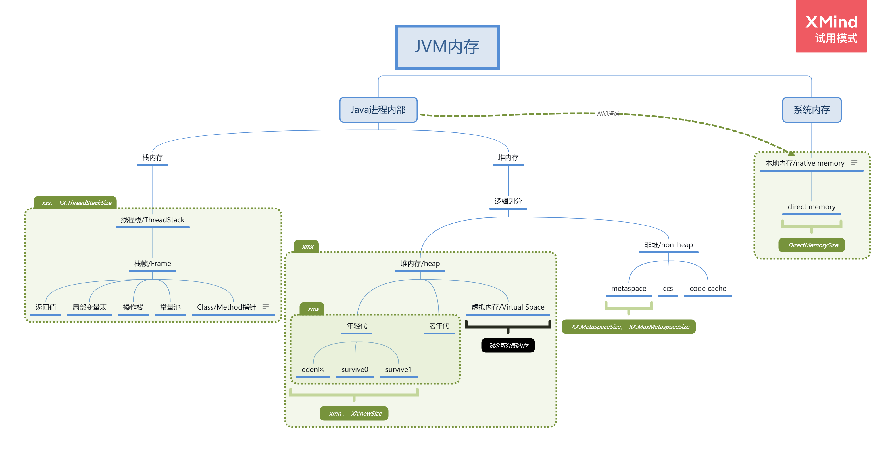

[toc]

# 第一题

> 自己写一个简单的 Hello.java，里面需要涉及基本类型，四则运行，if 和 for，然后自己分析一下对应的字节码，有问题群里讨论。


## 准备

代码及字节码文件路径：project\src\main\java\top\zsmile\jvm\work

执行命令如下：

```shell
* javac -g Hello.java
* javap -c -verbose Hello.class > Hello.txt
```


## 分析

### 整体划分

1. 文件信息
   - 编译的class文件位置
   - 最后修改时间和问价大小
   - MD5校验和
   - 从哪个java文件进行编译的

```shell
Classfile /D:/project/B.Smile/geek-study/project/src/main/java/top/zsmile/jvm/work/Hello.class
  Last modified 2021-6-25; size 1415 bytes
  MD5 checksum 945df21befdf3accdd6744189b6bc3fa
  Compiled from "Hello.java"
```

2. class信息
   1. 包路径和类名
   2. jdk版本信息
   3. 访问标志符
      - ACC_PUBLIC：对应 public 关键字
      - ACC_SUPER：修正无参构造器中的 invokespecial 指令调用super方法的bug。

```shell
public class top.zsmile.jvm.work.Hello
  minor version: 0
  major version: 52
  flags: ACC_PUBLIC, ACC_SUPER
```

3. 常量池

```shell
Constant pool:
   #1 = Methodref          #18.#45        // java/lang/Object."<init>":()V
   #2 = Fieldref           #46.#47        // java/lang/System.out:Ljava/io/PrintStream;
   #3 = String             #48            // iNumber, Index from small to big
   #4 = Methodref          #49.#50        // java/io/PrintStream.println:(Ljava/lang/String;)V
   #5 = Fieldref           #17.#51        // top/zsmile/jvm/work/Hello.iNumber:[I
   #6 = String             #52            // sum * 3
   #7 = Methodref          #17.#53        // top/zsmile/jvm/work/Hello.multiplyNum:(II)I
   #8 = String             #54            // sum / 2
   #9 = String             #55            // sum - 1024
  #10 = Class              #56            // java/lang/StringBuilder
  #11 = Methodref          #10.#45        // java/lang/StringBuilder."<init>":
```

4. 类信息

> 用{}包起来的部分


```
{
  public top.zsmile.jvm.work.Hello();
    descriptor: ()V
	...
	...s
     LineNumberTable:
        line 11: 0
}
```


### 类信息详细分析

我们先看一下除了main方法以外的部分

#### 无参数构造方法

```shell
public top.zsmile.jvm.work.Hello();
  descriptor: ()V
  flags: ACC_PUBLIC
  Code:
    stack=1, locals=1, args_size=1
       0: aload_0
       1: invokespecial #1                  // Method java/lang/Object."<init>":()V
       4: return
    LineNumberTable:
      line 9: 0
    LocalVariableTable:
      Start  Length  Slot  Name   Signature
          0       5     0  this   Ltop/zsmile/jvm/work/Hello;
```

1. descriptor: ()V。这里可以看出这是一个他的传参和返回值。()表示无参数，V表示void

2.  flags: ACC_PUBLIC。访问标识符只有个ACC_PUBLIC表示这是公共的

3. stack=1, locals=1, args_size=1。这里对应栈深度和本地变量表和参数槽大小。这里args_size为1是因为非静态方法，this会被绑定到局部变量表(LocalVariableTable)的第一个。

   > 这里引用一下javascript的call方法，使用call(null)时，非严格模式下则会绑定window全局对象。

4. LineNumberTable。 对应源代码位置

#### public和private 静态方法

这里可以看到有一个有趣的现象，在.java和.class源文件中，我们都能看到这样的代码。

```java

    public static int multiplyNum(int num, int mn) {
        return num * mn;
    }

    private static int divNum(int num, int mn) {
        return num / mn;
    }

    protected static int addNum(int num, int mn) {
        return num + mn;
    }

    protected static int subNum(int num, int mn) {
        return num - mn;
    }
```

但是，在字节码文件中，我们只能看到 multiplyNum 、subNum 和 addNum，不能直接看到 divNum。

```shell
public static int multiplyNum(int, int);
  descriptor: (II)I
  flags: ACC_PUBLIC, ACC_STATIC
  Code:
    stack=2, locals=2, args_size=2
       0: iload_0
       1: iload_1
       2: imul
       3: ireturn
    LineNumberTable:
      line 14: 0
    LocalVariableTable:
      Start  Length  Slot  Name   Signature
          0       4     0   num   I
          0       4     1    mn   I
 

  protected static int addNum(int, int);
    descriptor: (II)I
    flags: ACC_PROTECTED, ACC_STATIC
    Code:
      stack=2, locals=2, args_size=2
         0: iload_0
         1: iload_1
         2: iadd
         3: ireturn
      LineNumberTable:
        line 22: 0
      LocalVariableTable:
        Start  Length  Slot  Name   Signature
            0       4     0   num   I
            0       4     1    mn   I

  protected static int subNum(int, int);
    descriptor: (II)I
    flags: ACC_PROTECTED, ACC_STATIC
    Code:
      stack=2, locals=2, args_size=2
         0: iload_0
         1: iload_1
         2: isub
         3: ireturn
      LineNumberTable:
        line 26: 0
      LocalVariableTable:
        Start  Length  Slot  Name   Signature
            0       4     0   num   I
            0       4     1    mn   I

```

这是因为javap不加参数的情况下只输出public 和 protect 修饰的方法和成员变量，执行以下代码既可看到 private 修饰的方法。

> javap -c -verbose -private Hello.class > Hello.txt

```
private static int divNum(int, int);
  descriptor: (II)I
  flags: ACC_PRIVATE, ACC_STATIC
  Code:
    stack=2, locals=2, args_size=2
       0: iload_0
       1: iload_1
       2: idiv
       3: ireturn
    LineNumberTable:
      line 18: 0
    LocalVariableTable:
      Start  Length  Slot  Name   Signature
          0       4     0   num   I
          0       4     1    mn   I
```

因为上面的是基础的四则运算，总的来看一下。

- stack=2, locals=2, args_size=2。这里的操作栈、本地变量、参数都是2个，都是int类型，对应slot 0 和 1。因为是静态方法，所以0号槽位没有被this占用。
- iload_0和iload1，表示获取局部变量表中的0槽位和1槽位的int类型数据
- iadd，isub，idiv，imul分别表示将操作栈的2个int类型数字进行加减乘除
- ireturn将运算过后的结果返回。


#### main方法


##### 局部变量表

这里的局部变量表在运行过程中，2-5号槽位都是存储临时数据。并非最后显示的结果

```shell
LocalVariableTable:
  Start  Length  Slot  Name   Signature
     32       7     5     i   I						数组 对应下表的值， iNumber[i]
    131      29     2     i   I						数组长度
      0     180     0  args   [Ljava/lang/String;	main方法的入参 字符串数组
      2     178     1   sum   I						计算结果
    163      17     2  dsum   D						int转double后的结果
    167      13     4  lsum   J						int转long后的结果
    171       9     6  fsum   F						int转flout后的结果
    175       5     7  bsum   B						int转byte后的结果
    179       1     8  csum   C						int转char后的结果
```

##### 静态块

```shell
static {};
  descriptor: ()V
  flags: ACC_STATIC
  Code:
    stack=4, locals=0, args_size=0
       0: bipush        6
       2: newarray       int
       4: dup
       5: iconst_0
       6: iconst_m1
       7: iastore
       8: dup
       9: iconst_1
      10: iconst_1
      11: iastore
      12: dup
      13: iconst_2
      14: iconst_5
      15: iastore
      16: dup
      17: iconst_3
      18: bipush        6
      20: iastore
      21: dup
      22: iconst_4
      23: sipush        128
      26: iastore
      27: dup
      28: iconst_5
      29: sipush        129
      32: iastore
      33: putstatic     #5                  // Field iNumber:[I
      36: return
    LineNumberTable:
      line 11: 0
```

- putstatic #5将iNumber数组推入常量池#5
- ....其它省略


##### 分析

1. 初始化变量sum等于0，循环添加到int变量sum。

**这一部分代码中，局部变量表表示**

- 2 ： iNumber 的引用。
- 3 ： iNumber 数组长度
- 4 ： 遍历下标 int 
- 5 ： iNumber 数组 对应下表的值， iNumber[i]

内容分析

- 这里iconst_0 将int 0压入操作栈，然后通过istore出栈保存到局部变量表槽位1。
- getstatic  #2 将system.out返回的对象PrintStrem压入栈 ，然后通过ldc 从常量表中获取字符串，再通过invokevirtual执行方法，输出字符串到控制台。
- getstatic #5 从常量池中获取静态数组iNumber的引用压入操作栈，然后通过astore_2将引用出栈保存到局部变量2号槽位，再用aload_2入栈iNumber引用，arrayLength计算iNumber长度，istore_3将数组长度出栈保存到3号槽位。
- iconst_0 入栈int 0，istore将int 0 出栈保存到4号槽位，iload 4 将遍历下标 int 从局部变量表4号槽位入栈，iload3将数组长度从局部变量表3号槽位入栈，通过if_icmpge比较下标是否大于等于(ge)长度，如果满足则跳转45行，否则继续运行循环体。
- 26-39行。用aload_2，iload4，从局部变量表中取出iNumber数组引用和下标值入栈，iaload则是读取对应数组下标的值，istore将这个值出栈到5槽位，iload_1和iload 5入栈sum和刚刚的值，invokestatic #6执行add方法（II）I表示 2个int参数返回int，将结果出栈保存到1号槽位，通过iinc 4,1将4号槽位（下标）递增1。goto返回20行。

```shell
 0: iconst_0
 1: istore_1
 
 2: getstatic     #2                  // Field java/lang/System.out:Ljava/io/PrintStream;
 5: ldc           #3                  // String iNumber, Index from small to big
 7: invokevirtual #4                  // Method java/io/PrintStream.println:(Ljava/lang/String;)V
 
10: getstatic     #5                  // Field iNumber:[I
13: astore_2
14: aload_2
15: arraylength
16: istore_3

17: iconst_0
18: istore        4
20: iload         4
22: iload_3
23: if_icmpge     45
26: aload_2
27: iload         4
29: iaload
30: istore        5
32: iload_1
33: iload         5
35: invokestatic  #6                  // Method addNum:(II)I
38: istore_1
39: iinc          4, 1
42: goto          20
```

乘除减方法，同理32-38。跳过。

这里有个简单的关于整形取值的。

- iconst。用于取值1~5
- bipush。用于取值-128~127
- sipush。用于取值-32768~32767
- ldc。用于取值-2147483648~2147483647

有几点需要注意：

- 取值-1时采用iconst_m1指令
- ldc指令是从常量池中获取值的，也能用来获取字符串

然后是一个if用来判断sum的数是否大于0，如果大于输出字符串。分析如下

- iload入栈sum的值，然后ifle比较sum是否小于0，如果小于前往118行。等价于 iconst_0, if_cmple
- 96、99、100初始化StringBuilder对象(空字符串)。然后103、104、107、109，iload_1入栈sum的值，并执行append追加到StringBuilder对象，ldc           #16获取字符串，并执行append追加到StringBuilder对象。最后通过执行toString方法生成字符串(String)，并输出控制台。**这里就可以看出我们对于每一个String是不可变的，然后+号对于字符串拼接的操作就是生成StringBuilder 并用append添加到StringBuilder，最后才toString 生成字符串。**

```shell
 89: iload_1
 90: ifle          118
 
 93: getstatic     #2                  // Field java/lang/System.out:Ljava/io/PrintStream;
 96: new           #13                 // class java/lang/StringBuilder
 99: dup
100: invokespecial #14                 // Method java/lang/StringBuilder."<init>":()V
103: iload_1
104: invokevirtual #15                 // Method java/lang/StringBuilder.append:(I)Ljava/lang/StringBuilder;
107: ldc           #16                 // String  gt zero
109: invokevirtual #17                 // Method java/lang/StringBuilder.append:(Ljava/lang/String;)Ljava/lang/StringBuilder;
112: invokevirtual #18                 // Method java/lang/StringBuilder.toString:()Ljava/lang/String;
115: invokevirtual #4                  // Method java/io/PrintStream.println:(Ljava/lang/String;)V
```

for循环+if判断的部分，跟上面单独分析的部分同理，掠过。

最后是关于类型转换的。

- 将int sum分别转为double、long、float、byte、char然后分别出栈存入4、6、7、8

```
160: iload_1
161: i2d
162: dstore_2
163: iload_1
164: i2l
165: lstore        4
167: iload_1
168: i2f
169: fstore        6
171: iload_1
172: i2b
173: istore        7
175: iload_1
176: i2c
177: istore        8
```


##### StackMapTable （栈图）

```shell
StackMapTable: number_of_entries = 6
  frame_type = 255 /* full_frame */
    offset_delta = 20
    locals = [ class "[Ljava/lang/String;", int, class "[I", int, int ]
    stack = []
  frame_type = 248 /* chop */
    offset_delta = 24
  frame_type = 251 /* same_frame_extended */
    offset_delta = 72
  frame_type = 252 /* append */
    offset_delta = 12
    locals = [ int ]
  frame_type = 22 /* same */
  frame_type = 250 /* chop */
    offset_delta = 5
```

- number_of_entries表示entries的个数；
- 每一个entry元素都表示一个方法的stakemapFrame(栈帧)；


# 第二题

project\src\main\java\top\zsmile\jvm\classloader\XClassLoader

```java
public class XClassLoader extends ClassLoader {

    public static void main(String[] args) throws ClassNotFoundException {
        String className = "Hello";
        String methodName = "hello";
        ClassLoader xClassLoader = new XClassLoader();
        Class<?> helloClass = xClassLoader.loadClass(className);

        try {
            Object o = helloClass.newInstance();
            Method method = helloClass.getMethod(methodName);
            method.invoke(o);
        } catch (NoSuchMethodException e) {
            e.printStackTrace();
        } catch (IllegalAccessException e) {
            e.printStackTrace();
        } catch (InstantiationException e) {
            e.printStackTrace();
        } catch (InvocationTargetException e) {
            e.printStackTrace();
        }


    }

    @Override
    protected Class<?> findClass(String name) throws ClassNotFoundException {
        final String suffix = ".xlass";
        InputStream resourceAsStream = this.getClass().getResourceAsStream(name + suffix);

        try {
            int available = resourceAsStream.available();
            byte[] bytes = new byte[available];
            resourceAsStream.read(bytes);

            byte[] decode = decode(bytes);
            return defineClass(name, decode, 0, decode.length);
        } catch (IOException e) {
            e.printStackTrace();
            throw new ClassNotFoundException();
        } finally {
            if (resourceAsStream != null) {
                try {
                    resourceAsStream.close();
                } catch (IOException e) {
                    e.printStackTrace();
                }
            }
        }
    }

    public byte[] decode(byte[] code) {
        byte[] decodeBytes = new byte[code.length];
        for (int i = 0; i < code.length; i++) {
            decodeBytes[i] = (byte) (255 - code[i]);
        }
        return decodeBytes;
    }
}
```


# 第三题

文件：JVM内存.png

