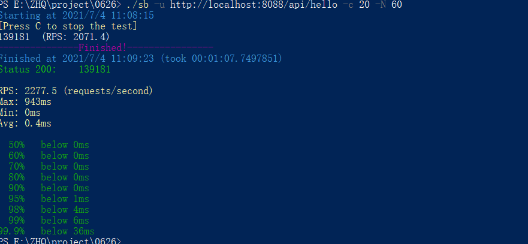
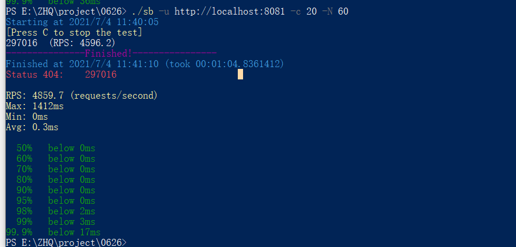
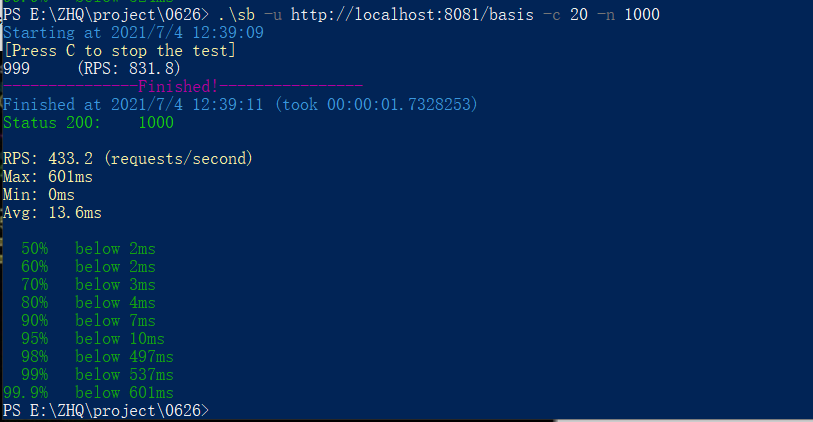

[toc]

---

# 题目

**1. （选做）**使用 GCLogAnalysis.java 自己演练一遍串行 / 并行 /CMS/G1 的案例。

**2. （选做）**使用压测工具（wrk 或 sb），演练 gateway-server-0.0.1-SNAPSHOT.jar 示例。

**3. （选做）**如果自己本地有可以运行的项目，可以按照 2 的方式进行演练。

**4. （必做）**根据上述自己对于 1 和 2 的演示，写一段对于不同 GC 和堆内存的总结，提交到 GitHub。

**5. （选做）**运行课上的例子，以及 Netty 的例子，分析相关现象。
**6. （必做）**写一段代码，使用 HttpClient 或 OkHttp 访问 [ http://localhost:8801 ](http://localhost:8801/)，代码提交到 GitHub


# 作业1

## 编码插曲

> javac GCLogAnalysis.java

出现错误: 编码GBK的不可映射字符，将文件重新保存为utf-8依然出错。于是在编译的时候，制定了编码格式

> javac -encoding utf8 GCLogAnalysis.java

编译成功，进入正题。


## 关于xms和xmn使用错误

> java -Xmx1g -Xmn1g -XX:+UseSerialGC -Xloggc:gc.serial.1g.log -XX:+PrintGCDetails -XX:+PrintGCDateStamps  GCLogAnalysis

文件地址： \project\src\main\java\top\zsmile\jvm\gc\gc.serial.xmn1g.log

```shell
Java HotSpot(TM) 64-Bit Server VM (25.201-b09) for windows-amd64 JRE (1.8.0_201-b09), built on Dec 15 2018 18:36:39 by "java_re" with MS VC++ 10.0 (VS2010)
Memory: 4k page, physical 8255784k(2719980k free), swap 13958276k(2202144k free)
CommandLine flags: -XX:InitialHeapSize=1073741824 -XX:MaxHeapSize=1073741824 -XX:MaxNewSize=1073741824 -XX:NewSize=1073741824 -XX:+PrintGC -XX:+PrintGCDetails -XX:+PrintGCTimeStamps -XX:+UseCompressedClassPointers -XX:+UseCompressedOops -XX:-UseLargePagesIndividualAllocation -XX:+UseSerialGC 
0.422: [GC (Allocation Failure) 0.422: [DefNew (promotion failed) : 838848K->943680K(943680K), 0.0392286 secs]0.462: [Tenured: 63K->63K(64K), 0.0369619 secs] 838848K->201251K(943744K), [Metaspace: 2628K->2628K(1056768K)], 0.0764888 secs] [Times: user=0.03 sys=0.05, real=0.08 secs] 
0.608: [Full GC (Allocation Failure) 0.608: [Tenured: 63K->63K(64K), 0.0489366 secs] 943383K->285338K(943744K), [Metaspace: 2628K->2628K(1056768K)], 0.0489981 secs] [Times: user=0.05 sys=0.00, real=0.05 secs] 
0.746: [Full GC (Allocation Failure) 0.746: [Tenured: 63K->63K(64K), 0.0544844 secs] 943721K->324420K(943744K), [Metaspace: 2628K->2628K(1056768K)], 0.0545447 secs] [Times: user=0.05 sys=0.00, real=0.05 secs] 
0.889: [Full GC (Allocation Failure) 0.889: [Tenured: 63K->63K(64K), 0.0546671 secs] 943733K->326006K(943744K), [Metaspace: 2628K->2628K(1056768K)], 0.0547235 secs] [Times: user=0.06 sys=0.00, real=0.06 secs] 
1.041: [Full GC (Allocation Failure) 1.041: [Tenured: 63K->63K(64K), 0.0605872 secs] 943632K->346444K(943744K), [Metaspace: 2628K->2628K(1056768K)], 0.0606417 secs] [Times: user=0.06 sys=0.00, real=0.06 secs] 
Heap
 def new generation   total 943680K, used 376722K [0x00000000c0000000, 0x00000000ffff0000, 0x00000000ffff0000)
  eden space 838848K,  44% used [0x00000000c0000000, 0x00000000d6fe4a60, 0x00000000f3330000)
  from space 104832K,   0% used [0x00000000f9990000, 0x00000000f9990000, 0x00000000ffff0000)
  to   space 104832K,   0% used [0x00000000f3330000, 0x00000000f3330000, 0x00000000f9990000)
 tenured generation   total 64K, used 63K [0x00000000ffff0000, 0x0000000100000000, 0x0000000100000000)
   the space 64K,  99% used [0x00000000ffff0000, 0x00000000ffffffe0, 0x0000000100000000, 0x0000000100000000)
 Metaspace       used 2634K, capacity 4486K, committed 4864K, reserved 1056768K
  class space    used 291K, capacity 386K, committed 512K, reserved 1048576K
```

这里因为错误的使用设置新生代大小的-Xmn1g，然后可以看见，-Xmn1g同时设置了-XX:MaxNewSize和-XX:NewSize即新生代的最大值和当前值为1G

```
CommandLine flags: -XX:InitialHeapSize=1073741824 -XX:MaxHeapSize=1073741824 **-XX:MaxNewSize=1073741824 -XX:NewSize=1073741824 -XX:+PrintGC** -XX:+PrintGCDateStamps -XX:+PrintGCDetails -XX:+PrintGCTimeStamps -XX:+UseCompressedClassPointers -XX:+UseCompressedOops -XX:-UseLargePagesIndividualAllocation -XX:+UseSerialGC 
```

先看作后面的堆信息

```
Heap
 def new generation   total 943680K, used 376722K [0x00000000c0000000, 0x00000000ffff0000, 0x00000000ffff0000)
  eden space 838848K,  44% used [0x00000000c0000000, 0x00000000d6fe4a60, 0x00000000f3330000)
  from space 104832K,   0% used [0x00000000f9990000, 0x00000000f9990000, 0x00000000ffff0000)
  to   space 104832K,   0% used [0x00000000f3330000, 0x00000000f3330000, 0x00000000f9990000)
 tenured generation   total 64K, used 63K [0x00000000ffff0000, 0x0000000100000000, 0x0000000100000000)
   the space 64K,  99% used [0x00000000ffff0000, 0x00000000ffffffe0, 0x0000000100000000, 0x0000000100000000)
 Metaspace       used 2634K, capacity 4486K, committed 4864K, reserved 1056768K
  class space    used 291K, capacity 386K, committed 512K, reserved 1048576K
```

可以看出：

- 年轻代的总大小是943M，使用了376M。
- 其中根据年轻代默认的eden和survive区分配比例8：2。eden区总大小838M，有44%使用了，s0和s1总大小一致，都为104M，无使用。
- 老年代的总大小64K，使用63K，这是很不合理的，分析后发现整个堆内存1G，然后因为配置错误，导致年轻代将整个堆内存占用了。
- Metaspace使用了2.6M，容量为4.4M。classspace使用了0.2M，容量为0.3M。


然后我们再看一下GC日志信息

```shell
0.422: [GC (Allocation Failure) 0.422: [DefNew (promotion failed) : 838848K->943680K(943680K), 0.0392286 secs]0.462: [Tenured: 63K->63K(64K), 0.0369619 secs] 838848K->201251K(943744K), [Metaspace: 2628K->2628K(1056768K)], 0.0764888 secs] [Times: user=0.03 sys=0.05, real=0.08 secs] 
0.608: [Full GC (Allocation Failure) 0.608: [Tenured: 63K->63K(64K), 0.0489366 secs] 943383K->285338K(943744K), [Metaspace: 2628K->2628K(1056768K)], 0.0489981 secs] [Times: user=0.05 sys=0.00, real=0.05 secs] 
0.746: [Full GC (Allocation Failure) 0.746: [Tenured: 63K->63K(64K), 0.0544844 secs] 943721K->324420K(943744K), [Metaspace: 2628K->2628K(1056768K)], 0.0545447 secs] [Times: user=0.05 sys=0.00, real=0.05 secs] 
0.889: [Full GC (Allocation Failure) 0.889: [Tenured: 63K->63K(64K), 0.0546671 secs] 943733K->326006K(943744K), [Metaspace: 2628K->2628K(1056768K)], 0.0547235 secs] [Times: user=0.06 sys=0.00, real=0.06 secs] 
1.041: [Full GC (Allocation Failure) 1.041: [Tenured: 63K->63K(64K), 0.0605872 secs] 943632K->346444K(943744K), [Metaspace: 2628K->2628K(1056768K)], 0.0606417 secs] [Times: user=0.06 sys=0.00, real=0.06 secs] 
```

从文件里可以看到第一次gc是在0.422秒，因为分配失败，这时年轻代还发生了一个异常错误promotion failed，年轻代总空间有943M，内存从838M增加到了943M，用时0.04s，然后老年代只有64k总大小，这使得年轻代的对象无法提升到老年代，只能继续积压在年轻代。

然后接着将对老年代对象回收，从63k到63k意味着没有回收，但是堆内存从838M降到了201M，可以推测一下应该是年轻代的对象直接被回收了。

从0.608开始法神了4次FullGC， 每次Full GC执行完后，老年代的占用空间都没有发生变化，对内存都出现来大幅度的下降，可以估计是年轻代的对象无法晋升老年代，直接被回收了。平均耗时0.5s左右。

总结：我们可以看出没有执行minorgc，全部都是majorGC，所有的回收都是fullGC回收的。把gc日志导入gceasy。可以看到这样的一份统计图验证猜想。


## 串行GC

> java -Xmx1g -Xms1g -XX:+UseSerialGC -Xloggc:gc.serial.1g.log -XX:+PrintGCDetails  GCLogAnalysis

文件地址： \project\src\main\java\top\zsmile\jvm\gc\gc.serial.1g.log

```shell
Java HotSpot(TM) 64-Bit Server VM (25.201-b09) for windows-amd64 JRE (1.8.0_201-b09), built on Dec 15 2018 18:36:39 by "java_re" with MS VC++ 10.0 (VS2010)
Memory: 4k page, physical 8255784k(2637420k free), swap 14880400k(2796136k free)
CommandLine flags: -XX:InitialHeapSize=1073741824 -XX:MaxHeapSize=1073741824 -XX:+PrintGC -XX:+PrintGCDetails -XX:+PrintGCTimeStamps -XX:+UseCompressedClassPointers -XX:+UseCompressedOops -XX:-UseLargePagesIndividualAllocation -XX:+UseSerialGC 
0.201: [GC (Allocation Failure) 0.201: [DefNew: 279616K->34944K(314560K), 0.0312410 secs] 279616K->83660K(1013632K), 0.0313687 secs] [Times: user=0.00 sys=0.03, real=0.03 secs] 
0.272: [GC (Allocation Failure) 0.272: [DefNew: 314560K->34944K(314560K), 0.0410823 secs] 363276K->161628K(1013632K), 0.0411405 secs] [Times: user=0.02 sys=0.03, real=0.04 secs] 
0.352: [GC (Allocation Failure) 0.352: [DefNew: 314560K->34943K(314560K), 0.0326501 secs] 441244K->234029K(1013632K), 0.0327081 secs] [Times: user=0.03 sys=0.00, real=0.03 secs] 
0.422: [GC (Allocation Failure) 0.422: [DefNew: 314559K->34943K(314560K), 0.0357819 secs] 513645K->316168K(1013632K), 0.0358370 secs] [Times: user=0.03 sys=0.00, real=0.04 secs] 
0.498: [GC (Allocation Failure) 0.498: [DefNew: 314559K->34943K(314560K), 0.0353872 secs] 595784K->392778K(1013632K), 0.0354687 secs] [Times: user=0.02 sys=0.02, real=0.04 secs] 
0.580: [GC (Allocation Failure) 0.580: [DefNew: 314559K->34944K(314560K), 0.0425928 secs] 672394K->477051K(1013632K), 0.0426480 secs] [Times: user=0.05 sys=0.00, real=0.04 secs] 
0.659: [GC (Allocation Failure) 0.659: [DefNew: 314560K->34943K(314560K), 0.0374878 secs] 756667K->558900K(1013632K), 0.0375414 secs] [Times: user=0.00 sys=0.03, real=0.04 secs] 
0.734: [GC (Allocation Failure) 0.734: [DefNew: 314559K->34943K(314560K), 0.0337327 secs] 838516K->635955K(1013632K), 0.0337867 secs] [Times: user=0.00 sys=0.03, real=0.03 secs] 
0.806: [GC (Allocation Failure) 0.806: [DefNew: 314559K->34943K(314560K), 0.0338643 secs] 915571K->710926K(1013632K), 0.0339186 secs] [Times: user=0.00 sys=0.03, real=0.03 secs] 
0.879: [GC (Allocation Failure) 0.879: [DefNew: 314559K->314559K(314560K), 0.0000119 secs]0.879: [Tenured: 675982K->373961K(699072K), 0.0619216 secs] 990542K->373961K(1013632K), [Metaspace: 2628K->2628K(1056768K)], 0.0624081 secs] [Times: user=0.06 sys=0.00, real=0.06 secs] 
0.983: [GC (Allocation Failure) 0.983: [DefNew: 279616K->34942K(314560K), 0.0154252 secs] 653577K->456559K(1013632K), 0.0154846 secs] [Times: user=0.02 sys=0.00, real=0.02 secs] 
1.044: [GC (Allocation Failure) 1.044: [DefNew: 314558K->34943K(314560K), 0.0239372 secs] 736175K->540799K(1013632K), 0.0240192 secs] [Times: user=0.02 sys=0.02, real=0.02 secs] 
Heap
 def new generation   total 314560K, used 195977K [0x00000000c0000000, 0x00000000d5550000, 0x00000000d5550000)
  eden space 279616K,  57% used [0x00000000c0000000, 0x00000000c9d42530, 0x00000000d1110000)
  from space 34944K,  99% used [0x00000000d3330000, 0x00000000d554fff8, 0x00000000d5550000)
  to   space 34944K,   0% used [0x00000000d1110000, 0x00000000d1110000, 0x00000000d3330000)
 tenured generation   total 699072K, used 505855K [0x00000000d5550000, 0x0000000100000000, 0x0000000100000000)
   the space 699072K,  72% used [0x00000000d5550000, 0x00000000f434ff20, 0x00000000f4350000, 0x0000000100000000)
 Metaspace       used 2634K, capacity 4486K, committed 4864K, reserved 1056768K
  class space    used 291K, capacity 386K, committed 512K, reserved 1048576K

```

先看作后面的堆信息

```shell
Heap
 def new generation   total 314560K, used 195977K [0x00000000c0000000, 0x00000000d5550000, 0x00000000d5550000)
  eden space 279616K,  57% used [0x00000000c0000000, 0x00000000c9d42530, 0x00000000d1110000)
  from space 34944K,  99% used [0x00000000d3330000, 0x00000000d554fff8, 0x00000000d5550000)
  to   space 34944K,   0% used [0x00000000d1110000, 0x00000000d1110000, 0x00000000d3330000)
 tenured generation   total 699072K, used 505855K [0x00000000d5550000, 0x0000000100000000, 0x0000000100000000)
   the space 699072K,  72% used [0x00000000d5550000, 0x00000000f434ff20, 0x00000000f4350000, 0x0000000100000000)
 Metaspace       used 2634K, capacity 4486K, committed 4864K, reserved 1056768K
  class space    used 291K, capacity 386K, committed 512K, reserved 1048576K
```

可以看出：

- 年轻代的总大小是314M，使用了195M。
- 其中eden区总大小279M，有57%使用了，s0和s1总大小一致，都为34.9M。
- 老年代的总大小699M，使用505M。
- Metaspace使用了2.6M，容量为4.4M。classspace使用了0.2M，容量为0.3M。

然后我们再看一下GC日志信息

```shell
0.201: [GC (Allocation Failure) 0.201: [DefNew: 279616K->34944K(314560K), 0.0312410 secs] 279616K->83660K(1013632K), 0.0313687 secs] [Times: user=0.00 sys=0.03, real=0.03 secs] 
0.272: [GC (Allocation Failure) 0.272: [DefNew: 314560K->34944K(314560K), 0.0410823 secs] 363276K->161628K(1013632K), 0.0411405 secs] [Times: user=0.02 sys=0.03, real=0.04 secs] 
0.352: [GC (Allocation Failure) 0.352: [DefNew: 314560K->34943K(314560K), 0.0326501 secs] 441244K->234029K(1013632K), 0.0327081 secs] [Times: user=0.03 sys=0.00, real=0.03 secs] 
0.422: [GC (Allocation Failure) 0.422: [DefNew: 314559K->34943K(314560K), 0.0357819 secs] 513645K->316168K(1013632K), 0.0358370 secs] [Times: user=0.03 sys=0.00, real=0.04 secs] 
0.498: [GC (Allocation Failure) 0.498: [DefNew: 314559K->34943K(314560K), 0.0353872 secs] 595784K->392778K(1013632K), 0.0354687 secs] [Times: user=0.02 sys=0.02, real=0.04 secs] 
0.580: [GC (Allocation Failure) 0.580: [DefNew: 314559K->34944K(314560K), 0.0425928 secs] 672394K->477051K(1013632K), 0.0426480 secs] [Times: user=0.05 sys=0.00, real=0.04 secs] 
0.659: [GC (Allocation Failure) 0.659: [DefNew: 314560K->34943K(314560K), 0.0374878 secs] 756667K->558900K(1013632K), 0.0375414 secs] [Times: user=0.00 sys=0.03, real=0.04 secs] 
0.734: [GC (Allocation Failure) 0.734: [DefNew: 314559K->34943K(314560K), 0.0337327 secs] 838516K->635955K(1013632K), 0.0337867 secs] [Times: user=0.00 sys=0.03, real=0.03 secs] 
0.806: [GC (Allocation Failure) 0.806: [DefNew: 314559K->34943K(314560K), 0.0338643 secs] 915571K->710926K(1013632K), 0.0339186 secs] [Times: user=0.00 sys=0.03, real=0.03 secs] 
0.879: [GC (Allocation Failure) 0.879: [DefNew: 314559K->314559K(314560K), 0.0000119 secs]0.879: [Tenured: 675982K->373961K(699072K), 0.0619216 secs] 990542K->373961K(1013632K), [Metaspace: 2628K->2628K(1056768K)], 0.0624081 secs] [Times: user=0.06 sys=0.00, real=0.06 secs] 
0.983: [GC (Allocation Failure) 0.983: [DefNew: 279616K->34942K(314560K), 0.0154252 secs] 653577K->456559K(1013632K), 0.0154846 secs] [Times: user=0.02 sys=0.00, real=0.02 secs] 
1.044: [GC (Allocation Failure) 1.044: [DefNew: 314558K->34943K(314560K), 0.0239372 secs] 736175K->540799K(1013632K), 0.0240192 secs] [Times: user=0.02 sys=0.02, real=0.02 secs] 
```

0.201发生了第一次GC，这时新生代内存从279M降到了34M，堆内存从279M降到了83M，也就是有49M对象提升到了老年代，实际使用时间0.03s。

然后后面一直执行到0.879s时，发生了一次fullGC，这时新生代内存为314M，基本填满了整个新生代，然后老年代从675M降低到373M，整个堆内存，从990M降低到了373M，也就是说，此时新生代对象基本都被回收了，然后堆内存中只剩下了老年代中的对象，用时60ms。


我们来算一下提升速率和分配速率

| Event  | Time  | Young before | Total after | Allocated during | Allocation rate |
| ------ | ----- | ------------ | ----------- | ---------------- | --------------- |
| 1st GC | 201ms | 244672k      | 34944k      | 209,728k         | 1,018 MB/s      |
| 2nd GC | 272ms | 279,616k     | 34944k      | 244,672k         | 878 MB/s        |
| 3rd GC | 352ms | 279,617k     | 34943k      | 244,674k         | 878 MB/s        |
| Total  | 352ms | -            | -           | 699,074k         | 1,939 MB/s      |

| Event  | Time  | Young decreased | Total decreased | Promoted | Promotion rate |
| ------ | ----- | --------------- | --------------- | -------- | -------------- |
| 1st GC | 201ms | 244672k         | 195956k         | 48716k   | 236.6 MB/s     |
| 2nd GC | 272ms | 279,616k        | 201,648k        | 77,968k  | 279.9 MB/s     |
| 3rd GC | 352ms | 279,617k        | 207,215k        | 72,402k  | 200.8 MB/s     |
| Total  | 352ms | -               | -               | 199,086k | 552 MB/s       |


## 并行GC

>  java -Xmx1g -Xms1g -XX:+UseParallelGC -Xloggc:gc.serial.1g.log -XX:+PrintGCDetails  GCLogAnalysis
>
> 文件地址： \project\src\main\java\top\zsmile\jvm\gc\gc.parallel.1g.log

```shell
Java HotSpot(TM) 64-Bit Server VM (25.201-b09) for windows-amd64 JRE (1.8.0_201-b09), built on Dec 15 2018 18:36:39 by "java_re" with MS VC++ 10.0 (VS2010)
Memory: 4k page, physical 8255784k(2554260k free), swap 14880400k(2750892k free)
CommandLine flags: -XX:InitialHeapSize=1073741824 -XX:MaxHeapSize=1073741824 -XX:+PrintGC -XX:+PrintGCDetails -XX:+PrintGCTimeStamps -XX:+UseCompressedClassPointers -XX:+UseCompressedOops -XX:-UseLargePagesIndividualAllocation -XX:+UseParallelGC 
0.198: [GC (Allocation Failure) [PSYoungGen: 261989K->43506K(305664K)] 261989K->78446K(1005056K), 0.0156817 secs] [Times: user=0.00 sys=0.09, real=0.02 secs] 
0.254: [GC (Allocation Failure) [PSYoungGen: 305650K->43499K(305664K)] 340590K->157490K(1005056K), 0.0228875 secs] [Times: user=0.02 sys=0.08, real=0.02 secs] 
0.315: [GC (Allocation Failure) [PSYoungGen: 305643K->43505K(305664K)] 419634K->234121K(1005056K), 0.0218060 secs] [Times: user=0.05 sys=0.03, real=0.02 secs] 
0.372: [GC (Allocation Failure) [PSYoungGen: 305419K->43504K(305664K)] 496035K->305498K(1005056K), 0.0216133 secs] [Times: user=0.14 sys=0.03, real=0.02 secs] 
0.428: [GC (Allocation Failure) [PSYoungGen: 305648K->43516K(305664K)] 567642K->379658K(1005056K), 0.0214147 secs] [Times: user=0.05 sys=0.05, real=0.02 secs] 
0.484: [GC (Allocation Failure) [PSYoungGen: 305660K->43502K(160256K)] 641802K->440680K(859648K), 0.0195325 secs] [Times: user=0.00 sys=0.09, real=0.02 secs] 
0.519: [GC (Allocation Failure) [PSYoungGen: 160238K->70521K(232960K)] 557416K->477216K(932352K), 0.0144999 secs] [Times: user=0.09 sys=0.00, real=0.01 secs] 
0.550: [GC (Allocation Failure) [PSYoungGen: 187257K->91550K(232960K)] 593952K->508356K(932352K), 0.0182251 secs] [Times: user=0.09 sys=0.00, real=0.02 secs] 
0.584: [GC (Allocation Failure) [PSYoungGen: 208286K->108761K(232960K)] 625092K->540816K(932352K), 0.0218468 secs] [Times: user=0.09 sys=0.00, real=0.02 secs] 
0.623: [GC (Allocation Failure) [PSYoungGen: 225497K->75663K(232960K)] 657552K->566373K(932352K), 0.0235529 secs] [Times: user=0.17 sys=0.02, real=0.02 secs] 
0.662: [GC (Allocation Failure) [PSYoungGen: 192399K->42511K(232960K)] 683109K->597641K(932352K), 0.0220678 secs] [Times: user=0.06 sys=0.03, real=0.02 secs] 
0.699: [GC (Allocation Failure) [PSYoungGen: 159247K->37588K(232960K)] 714377K->629427K(932352K), 0.0171352 secs] [Times: user=0.01 sys=0.06, real=0.02 secs] 
0.732: [GC (Allocation Failure) [PSYoungGen: 154324K->41816K(232960K)] 746163K->666756K(932352K), 0.0169413 secs] [Times: user=0.11 sys=0.06, real=0.02 secs] 
0.749: [Full GC (Ergonomics) [PSYoungGen: 41816K->0K(232960K)] [ParOldGen: 624940K->331384K(699392K)] 666756K->331384K(932352K), [Metaspace: 2628K->2628K(1056768K)], 0.0645287 secs] [Times: user=0.28 sys=0.02, real=0.07 secs] 
0.832: [GC (Allocation Failure) [PSYoungGen: 116736K->40506K(232960K)] 448120K->371890K(932352K), 0.0085852 secs] [Times: user=0.00 sys=0.00, real=0.01 secs] 
0.860: [GC (Allocation Failure) [PSYoungGen: 157242K->41094K(232960K)] 488626K->407817K(932352K), 0.0139955 secs] [Times: user=0.00 sys=0.00, real=0.01 secs] 
0.894: [GC (Allocation Failure) [PSYoungGen: 157827K->37658K(232960K)] 524549K->442141K(932352K), 0.0133542 secs] [Times: user=0.08 sys=0.00, real=0.01 secs] 
0.926: [GC (Allocation Failure) [PSYoungGen: 154394K->39095K(232960K)] 558877K->478899K(932352K), 0.0133458 secs] [Times: user=0.09 sys=0.00, real=0.01 secs] 
0.958: [GC (Allocation Failure) [PSYoungGen: 155831K->38010K(232960K)] 595635K->512989K(932352K), 0.0131853 secs] [Times: user=0.08 sys=0.00, real=0.01 secs] 
0.986: [GC (Allocation Failure) [PSYoungGen: 154746K->39071K(232960K)] 629725K->549135K(932352K), 0.0136251 secs] [Times: user=0.09 sys=0.00, real=0.01 secs] 
1.018: [GC (Allocation Failure) [PSYoungGen: 155807K->40867K(232960K)] 665871K->587232K(932352K), 0.0142154 secs] [Times: user=0.09 sys=0.00, real=0.01 secs] 
1.049: [GC (Allocation Failure) [PSYoungGen: 156980K->40588K(232960K)] 703345K->623837K(932352K), 0.0138534 secs] [Times: user=0.09 sys=0.00, real=0.01 secs] 
1.080: [GC (Allocation Failure) [PSYoungGen: 157324K->41269K(232960K)] 740573K->661896K(932352K), 0.0143789 secs] [Times: user=0.09 sys=0.00, real=0.02 secs] 
Heap
 PSYoungGen      total 232960K, used 60852K [0x00000000eab00000, 0x0000000100000000, 0x0000000100000000)
  eden space 116736K, 16% used [0x00000000eab00000,0x00000000ebe1fc68,0x00000000f1d00000)
  from space 116224K, 35% used [0x00000000f8e80000,0x00000000fb6cd738,0x0000000100000000)
  to   space 116224K, 0% used [0x00000000f1d00000,0x00000000f1d00000,0x00000000f8e80000)
 ParOldGen       total 699392K, used 620626K [0x00000000c0000000, 0x00000000eab00000, 0x00000000eab00000)
  object space 699392K, 88% used [0x00000000c0000000,0x00000000e5e14a70,0x00000000eab00000)
 Metaspace       used 2634K, capacity 4486K, committed 4864K, reserved 1056768K
  class space    used 291K, capacity 386K, committed 512K, reserved 1048576K

```


先看作后面的堆信息

```shell
Heap
 PSYoungGen      total 232960K, used 60852K [0x00000000eab00000, 0x0000000100000000, 0x0000000100000000)
  eden space 116736K, 16% used [0x00000000eab00000,0x00000000ebe1fc68,0x00000000f1d00000)
  from space 116224K, 35% used [0x00000000f8e80000,0x00000000fb6cd738,0x0000000100000000)
  to   space 116224K, 0% used [0x00000000f1d00000,0x00000000f1d00000,0x00000000f8e80000)
 ParOldGen       total 699392K, used 620626K [0x00000000c0000000, 0x00000000eab00000, 0x00000000eab00000)
  object space 699392K, 88% used [0x00000000c0000000,0x00000000e5e14a70,0x00000000eab00000)
 Metaspace       used 2634K, capacity 4486K, committed 4864K, reserved 1056768K
  class space    used 291K, capacity 386K, committed 512K, reserved 1048576K
```

可以看出：

- 年轻代的总大小是232M，使用了60M。
- 其中eden区总大小116M，有16%使用了，s0和s1总大小一致，都为116M。
- 老年代的总大小699M，使用505M。
- Metaspace使用了2.6M，容量为4.4M。classspace使用了0.2M，容量为0.3M。

然后我们再看一下GC日志信息

```shell
0.198: [GC (Allocation Failure) [PSYoungGen: 261989K->43506K(305664K)] 261989K->78446K(1005056K), 0.0156817 secs] [Times: user=0.00 sys=0.09, real=0.02 secs] 
0.254: [GC (Allocation Failure) [PSYoungGen: 305650K->43499K(305664K)] 340590K->157490K(1005056K), 0.0228875 secs] [Times: user=0.02 sys=0.08, real=0.02 secs] 
0.315: [GC (Allocation Failure) [PSYoungGen: 305643K->43505K(305664K)] 419634K->234121K(1005056K), 0.0218060 secs] [Times: user=0.05 sys=0.03, real=0.02 secs] 
0.372: [GC (Allocation Failure) [PSYoungGen: 305419K->43504K(305664K)] 496035K->305498K(1005056K), 0.0216133 secs] [Times: user=0.14 sys=0.03, real=0.02 secs] 
0.428: [GC (Allocation Failure) [PSYoungGen: 305648K->43516K(305664K)] 567642K->379658K(1005056K), 0.0214147 secs] [Times: user=0.05 sys=0.05, real=0.02 secs] 
0.484: [GC (Allocation Failure) [PSYoungGen: 305660K->43502K(160256K)] 641802K->440680K(859648K), 0.0195325 secs] [Times: user=0.00 sys=0.09, real=0.02 secs] 
0.519: [GC (Allocation Failure) [PSYoungGen: 160238K->70521K(232960K)] 557416K->477216K(932352K), 0.0144999 secs] [Times: user=0.09 sys=0.00, real=0.01 secs] 
0.550: [GC (Allocation Failure) [PSYoungGen: 187257K->91550K(232960K)] 593952K->508356K(932352K), 0.0182251 secs] [Times: user=0.09 sys=0.00, real=0.02 secs] 
0.584: [GC (Allocation Failure) [PSYoungGen: 208286K->108761K(232960K)] 625092K->540816K(932352K), 0.0218468 secs] [Times: user=0.09 sys=0.00, real=0.02 secs] 
0.623: [GC (Allocation Failure) [PSYoungGen: 225497K->75663K(232960K)] 657552K->566373K(932352K), 0.0235529 secs] [Times: user=0.17 sys=0.02, real=0.02 secs] 
0.662: [GC (Allocation Failure) [PSYoungGen: 192399K->42511K(232960K)] 683109K->597641K(932352K), 0.0220678 secs] [Times: user=0.06 sys=0.03, real=0.02 secs] 
0.699: [GC (Allocation Failure) [PSYoungGen: 159247K->37588K(232960K)] 714377K->629427K(932352K), 0.0171352 secs] [Times: user=0.01 sys=0.06, real=0.02 secs] 
0.732: [GC (Allocation Failure) [PSYoungGen: 154324K->41816K(232960K)] 746163K->666756K(932352K), 0.0169413 secs] [Times: user=0.11 sys=0.06, real=0.02 secs] 
0.749: [Full GC (Ergonomics) [PSYoungGen: 41816K->0K(232960K)] [ParOldGen: 624940K->331384K(699392K)] 666756K->331384K(932352K), [Metaspace: 2628K->2628K(1056768K)], 0.0645287 secs] [Times: user=0.28 sys=0.02, real=0.07 secs] 
0.832: [GC (Allocation Failure) [PSYoungGen: 116736K->40506K(232960K)] 448120K->371890K(932352K), 0.0085852 secs] [Times: user=0.00 sys=0.00, real=0.01 secs] 
0.860: [GC (Allocation Failure) [PSYoungGen: 157242K->41094K(232960K)] 488626K->407817K(932352K), 0.0139955 secs] [Times: user=0.00 sys=0.00, real=0.01 secs] 
0.894: [GC (Allocation Failure) [PSYoungGen: 157827K->37658K(232960K)] 524549K->442141K(932352K), 0.0133542 secs] [Times: user=0.08 sys=0.00, real=0.01 secs] 
0.926: [GC (Allocation Failure) [PSYoungGen: 154394K->39095K(232960K)] 558877K->478899K(932352K), 0.0133458 secs] [Times: user=0.09 sys=0.00, real=0.01 secs] 
0.958: [GC (Allocation Failure) [PSYoungGen: 155831K->38010K(232960K)] 595635K->512989K(932352K), 0.0131853 secs] [Times: user=0.08 sys=0.00, real=0.01 secs] 
0.986: [GC (Allocation Failure) [PSYoungGen: 154746K->39071K(232960K)] 629725K->549135K(932352K), 0.0136251 secs] [Times: user=0.09 sys=0.00, real=0.01 secs] 
1.018: [GC (Allocation Failure) [PSYoungGen: 155807K->40867K(232960K)] 665871K->587232K(932352K), 0.0142154 secs] [Times: user=0.09 sys=0.00, real=0.01 secs] 
1.049: [GC (Allocation Failure) [PSYoungGen: 156980K->40588K(232960K)] 703345K->623837K(932352K), 0.0138534 secs] [Times: user=0.09 sys=0.00, real=0.01 secs] 
1.080: [GC (Allocation Failure) [PSYoungGen: 157324K->41269K(232960K)] 740573K->661896K(932352K), 0.0143789 secs] [Times: user=0.09 sys=0.00, real=0.02 secs] 
```

0.198发生了第一次GC，这时新生代内存从261M降到了43M，堆内存从261M降到了78M，也就是有35M对象提升到了老年代，实际使用时间0.01s。

然后后面一直执行了12次GC后，到0.749s时，发生了一次fullGC，这时新生代内存为41M降低到了0M，然后老年代从624M降低到331M，整个堆内存，从666M降低到了331M，也就是说，此时新生代对象基本都被回收了，然后堆内存中只剩下了老年代中的对象，用时70ms。


## CMS GC

>  java -Xmx1g -Xms1g -XX:+UseConcMarkSweepGC -Xloggc:gc.serial.1g.log -XX:+PrintGCDetails  GCLogAnalysis
>
> 文件地址： \project\src\main\java\top\zsmile\jvm\gc\gc.ConcMarkSweep.1g.log

```shell
Java HotSpot(TM) 64-Bit Server VM (25.201-b09) for windows-amd64 JRE (1.8.0_201-b09), built on Dec 15 2018 18:36:39 by "java_re" with MS VC++ 10.0 (VS2010)
Memory: 4k page, physical 8255784k(2271148k free), swap 15212840k(2479412k free)
CommandLine flags: -XX:InitialHeapSize=1073741824 -XX:MaxHeapSize=1073741824 -XX:MaxNewSize=357916672 -XX:MaxTenuringThreshold=6 -XX:NewSize=357916672 -XX:OldPLABSize=16 -XX:OldSize=715825152 -XX:+PrintGC -XX:+PrintGCDetails -XX:+PrintGCTimeStamps -XX:+UseCompressedClassPointers -XX:+UseCompressedOops -XX:+UseConcMarkSweepGC -XX:-UseLargePagesIndividualAllocation -XX:+UseParNewGC 
0.216: [GC (Allocation Failure) 0.216: [ParNew: 279528K->34943K(314560K), 0.0271946 secs] 279528K->89611K(1013632K), 0.0273393 secs] [Times: user=0.13 sys=0.03, real=0.03 secs] 
0.287: [GC (Allocation Failure) 0.287: [ParNew: 314559K->34944K(314560K), 0.0334648 secs] 369227K->171625K(1013632K), 0.0335250 secs] [Times: user=0.05 sys=0.11, real=0.03 secs] 
0.361: [GC (Allocation Failure) 0.361: [ParNew: 314560K->34944K(314560K), 0.0326968 secs] 451241K->248821K(1013632K), 0.0327615 secs] [Times: user=0.19 sys=0.00, real=0.03 secs] 
0.429: [GC (Allocation Failure) 0.429: [ParNew: 314560K->34943K(314560K), 0.0355520 secs] 528437K->332905K(1013632K), 0.0356304 secs] [Times: user=0.16 sys=0.01, real=0.04 secs] 
0.503: [GC (Allocation Failure) 0.503: [ParNew: 314559K->34944K(314560K), 0.0317682 secs] 612521K->407532K(1013632K), 0.0318313 secs] [Times: user=0.14 sys=0.02, real=0.03 secs] 
0.535: [GC (CMS Initial Mark) [1 CMS-initial-mark: 372588K(699072K)] 407838K(1013632K), 0.0002304 secs] [Times: user=0.00 sys=0.00, real=0.00 secs] 
0.535: [CMS-concurrent-mark-start]
0.539: [CMS-concurrent-mark: 0.003/0.003 secs] [Times: user=0.00 sys=0.00, real=0.00 secs] 
0.539: [CMS-concurrent-preclean-start]
0.539: [CMS-concurrent-preclean: 0.001/0.001 secs] [Times: user=0.00 sys=0.00, real=0.00 secs] 
0.539: [CMS-concurrent-abortable-preclean-start]
0.574: [GC (Allocation Failure) 0.574: [ParNew: 314560K->34942K(314560K), 0.0331992 secs] 687148K->485954K(1013632K), 0.0332623 secs] [Times: user=0.16 sys=0.02, real=0.03 secs] 
0.644: [GC (Allocation Failure) 0.644: [ParNew: 314558K->34943K(314560K), 0.0361581 secs] 765570K->569800K(1013632K), 0.0362144 secs] [Times: user=0.17 sys=0.02, real=0.04 secs] 
0.717: [GC (Allocation Failure) 0.717: [ParNew: 314559K->34944K(314560K), 0.0308337 secs] 849416K->639894K(1013632K), 0.0308942 secs] [Times: user=0.16 sys=0.03, real=0.03 secs] 
0.783: [GC (Allocation Failure) 0.783: [ParNew: 314508K->34943K(314560K), 0.0314874 secs] 919458K->712353K(1013632K), 0.0315475 secs] [Times: user=0.17 sys=0.01, real=0.03 secs] 
0.815: [CMS-concurrent-abortable-preclean: 0.006/0.275 secs] [Times: user=0.81 sys=0.08, real=0.27 secs] 
0.815: [GC (CMS Final Remark) [YG occupancy: 41025 K (314560 K)]0.815: [Rescan (parallel) , 0.0003083 secs]0.815: [weak refs processing, 0.0000082 secs]0.815: [class unloading, 0.0001874 secs]0.815: [scrub symbol table, 0.0002548 secs]0.816: [scrub string table, 0.0000855 secs][1 CMS-remark: 677410K(699072K)] 718436K(1013632K), 0.0008966 secs] [Times: user=0.00 sys=0.00, real=0.00 secs] 
0.816: [CMS-concurrent-sweep-start]
0.817: [CMS-concurrent-sweep: 0.001/0.001 secs] [Times: user=0.00 sys=0.00, real=0.00 secs] 
0.817: [CMS-concurrent-reset-start]
0.818: [CMS-concurrent-reset: 0.001/0.001 secs] [Times: user=0.00 sys=0.00, real=0.00 secs] 
0.853: [GC (Allocation Failure) 0.853: [ParNew: 314559K->34942K(314560K), 0.0216930 secs] 853474K->647031K(1013632K), 0.0217527 secs] [Times: user=0.09 sys=0.00, real=0.02 secs] 
0.875: [GC (CMS Initial Mark) [1 CMS-initial-mark: 612088K(699072K)] 652924K(1013632K), 0.0001053 secs] [Times: user=0.00 sys=0.00, real=0.00 secs] 
0.875: [CMS-concurrent-mark-start]
0.877: [CMS-concurrent-mark: 0.002/0.002 secs] [Times: user=0.05 sys=0.00, real=0.00 secs] 
0.877: [CMS-concurrent-preclean-start]
0.878: [CMS-concurrent-preclean: 0.001/0.001 secs] [Times: user=0.00 sys=0.00, real=0.00 secs] 
0.878: [CMS-concurrent-abortable-preclean-start]
0.919: [GC (Allocation Failure) 0.919: [ParNew: 314558K->34943K(314560K), 0.0243508 secs] 926647K->724284K(1013632K), 0.0244692 secs] [Times: user=0.17 sys=0.00, real=0.02 secs] 
0.943: [CMS-concurrent-abortable-preclean: 0.001/0.065 secs] [Times: user=0.20 sys=0.00, real=0.07 secs] 
0.944: [GC (CMS Final Remark) [YG occupancy: 40625 K (314560 K)]0.944: [Rescan (parallel) , 0.0003482 secs]0.944: [weak refs processing, 0.0000076 secs]0.944: [class unloading, 0.0001757 secs]0.944: [scrub symbol table, 0.0002569 secs]0.944: [scrub string table, 0.0000851 secs][1 CMS-remark: 689340K(699072K)] 729965K(1013632K), 0.0009196 secs] [Times: user=0.00 sys=0.00, real=0.00 secs] 
0.945: [CMS-concurrent-sweep-start]
0.946: [CMS-concurrent-sweep: 0.001/0.001 secs] [Times: user=0.00 sys=0.00, real=0.00 secs] 
0.946: [CMS-concurrent-reset-start]
0.947: [CMS-concurrent-reset: 0.001/0.001 secs] [Times: user=0.00 sys=0.00, real=0.00 secs] 
0.983: [GC (Allocation Failure) 0.983: [ParNew: 314559K->34942K(314560K), 0.0199862 secs] 693724K->494478K(1013632K), 0.0200485 secs] [Times: user=0.19 sys=0.00, real=0.02 secs] 
1.003: [GC (CMS Initial Mark) [1 CMS-initial-mark: 459535K(699072K)] 500151K(1013632K), 0.0003402 secs] [Times: user=0.00 sys=0.00, real=0.00 secs] 
1.003: [CMS-concurrent-mark-start]
1.005: [CMS-concurrent-mark: 0.002/0.002 secs] [Times: user=0.00 sys=0.00, real=0.00 secs] 
1.005: [CMS-concurrent-preclean-start]
1.007: [CMS-concurrent-preclean: 0.001/0.001 secs] [Times: user=0.00 sys=0.00, real=0.00 secs] 
1.007: [CMS-concurrent-abortable-preclean-start]
1.048: [GC (Allocation Failure) 1.048: [ParNew: 314558K->34942K(314560K), 0.0204230 secs] 774094K->572404K(1013632K), 0.0204875 secs] [Times: user=0.09 sys=0.00, real=0.02 secs] 
Heap
 par new generation   total 314560K, used 255520K [0x00000000c0000000, 0x00000000d5550000, 0x00000000d5550000)
  eden space 279616K,  78% used [0x00000000c0000000, 0x00000000cd7689c0, 0x00000000d1110000)
  from space 34944K,  99% used [0x00000000d3330000, 0x00000000d554f8c8, 0x00000000d5550000)
  to   space 34944K,   0% used [0x00000000d1110000, 0x00000000d1110000, 0x00000000d3330000)
 concurrent mark-sweep generation total 699072K, used 537461K [0x00000000d5550000, 0x0000000100000000, 0x0000000100000000)
 Metaspace       used 2634K, capacity 4486K, committed 4864K, reserved 1056768K
  class space    used 291K, capacity 386K, committed 512K, reserved 1048576K


```


先看作后面的堆信息

```shell

Heap
 par new generation   total 314560K, used 255520K [0x00000000c0000000, 0x00000000d5550000, 0x00000000d5550000)
  eden space 279616K,  78% used [0x00000000c0000000, 0x00000000cd7689c0, 0x00000000d1110000)
  from space 34944K,  99% used [0x00000000d3330000, 0x00000000d554f8c8, 0x00000000d5550000)
  to   space 34944K,   0% used [0x00000000d1110000, 0x00000000d1110000, 0x00000000d3330000)
 concurrent mark-sweep generation total 699072K, used 537461K [0x00000000d5550000, 0x0000000100000000, 0x0000000100000000)
 Metaspace       used 2634K, capacity 4486K, committed 4864K, reserved 1056768K
  class space    used 291K, capacity 386K, committed 512K, reserved 1048576K

```

可以看出：

- 年轻代的总大小是314M，使用了255M。
- 其中eden区总大小279M，有78%使用了，s0和s1总大小一致，都为34M。
- 老年代的总大小699M，使用537M。
- Metaspace使用了2.6M，容量为4.4M。classspace使用了0.2M，容量为0.3M。

然后我们再看一下GC日志信息

```shell
0.216: [GC (Allocation Failure) 0.216: [ParNew: 279528K->34943K(314560K), 0.0271946 secs] 279528K->89611K(1013632K), 0.0273393 secs] [Times: user=0.13 sys=0.03, real=0.03 secs] 
0.287: [GC (Allocation Failure) 0.287: [ParNew: 314559K->34944K(314560K), 0.0334648 secs] 369227K->171625K(1013632K), 0.0335250 secs] [Times: user=0.05 sys=0.11, real=0.03 secs] 
0.361: [GC (Allocation Failure) 0.361: [ParNew: 314560K->34944K(314560K), 0.0326968 secs] 451241K->248821K(1013632K), 0.0327615 secs] [Times: user=0.19 sys=0.00, real=0.03 secs] 
0.429: [GC (Allocation Failure) 0.429: [ParNew: 314560K->34943K(314560K), 0.0355520 secs] 528437K->332905K(1013632K), 0.0356304 secs] [Times: user=0.16 sys=0.01, real=0.04 secs] 
0.503: [GC (Allocation Failure) 0.503: [ParNew: 314559K->34944K(314560K), 0.0317682 secs] 612521K->407532K(1013632K), 0.0318313 secs] [Times: user=0.14 sys=0.02, real=0.03 secs] 
0.535: [GC (CMS Initial Mark) [1 CMS-initial-mark: 372588K(699072K)] 407838K(1013632K), 0.0002304 secs] [Times: user=0.00 sys=0.00, real=0.00 secs] 
0.535: [CMS-concurrent-mark-start]
0.539: [CMS-concurrent-mark: 0.003/0.003 secs] [Times: user=0.00 sys=0.00, real=0.00 secs] 
0.539: [CMS-concurrent-preclean-start]
0.539: [CMS-concurrent-preclean: 0.001/0.001 secs] [Times: user=0.00 sys=0.00, real=0.00 secs] 
0.539: [CMS-concurrent-abortable-preclean-start]
0.574: [GC (Allocation Failure) 0.574: [ParNew: 314560K->34942K(314560K), 0.0331992 secs] 687148K->485954K(1013632K), 0.0332623 secs] [Times: user=0.16 sys=0.02, real=0.03 secs] 
0.644: [GC (Allocation Failure) 0.644: [ParNew: 314558K->34943K(314560K), 0.0361581 secs] 765570K->569800K(1013632K), 0.0362144 secs] [Times: user=0.17 sys=0.02, real=0.04 secs] 
0.717: [GC (Allocation Failure) 0.717: [ParNew: 314559K->34944K(314560K), 0.0308337 secs] 849416K->639894K(1013632K), 0.0308942 secs] [Times: user=0.16 sys=0.03, real=0.03 secs] 
0.783: [GC (Allocation Failure) 0.783: [ParNew: 314508K->34943K(314560K), 0.0314874 secs] 919458K->712353K(1013632K), 0.0315475 secs] [Times: user=0.17 sys=0.01, real=0.03 secs] 
0.815: [CMS-concurrent-abortable-preclean: 0.006/0.275 secs] [Times: user=0.81 sys=0.08, real=0.27 secs] 
0.815: [GC (CMS Final Remark) [YG occupancy: 41025 K (314560 K)]0.815: [Rescan (parallel) , 0.0003083 secs]0.815: [weak refs processing, 0.0000082 secs]0.815: [class unloading, 0.0001874 secs]0.815: [scrub symbol table, 0.0002548 secs]0.816: [scrub string table, 0.0000855 secs][1 CMS-remark: 677410K(699072K)] 718436K(1013632K), 0.0008966 secs] [Times: user=0.00 sys=0.00, real=0.00 secs] 
0.816: [CMS-concurrent-sweep-start]
0.817: [CMS-concurrent-sweep: 0.001/0.001 secs] [Times: user=0.00 sys=0.00, real=0.00 secs] 
0.817: [CMS-concurrent-reset-start]
0.818: [CMS-concurrent-reset: 0.001/0.001 secs] [Times: user=0.00 sys=0.00, real=0.00 secs] 
0.853: [GC (Allocation Failure) 0.853: [ParNew: 314559K->34942K(314560K), 0.0216930 secs] 853474K->647031K(1013632K), 0.0217527 secs] [Times: user=0.09 sys=0.00, real=0.02 secs] 
0.875: [GC (CMS Initial Mark) [1 CMS-initial-mark: 612088K(699072K)] 652924K(1013632K), 0.0001053 secs] [Times: user=0.00 sys=0.00, real=0.00 secs] 
0.875: [CMS-concurrent-mark-start]
0.877: [CMS-concurrent-mark: 0.002/0.002 secs] [Times: user=0.05 sys=0.00, real=0.00 secs] 
0.877: [CMS-concurrent-preclean-start]
0.878: [CMS-concurrent-preclean: 0.001/0.001 secs] [Times: user=0.00 sys=0.00, real=0.00 secs] 
0.878: [CMS-concurrent-abortable-preclean-start]
0.919: [GC (Allocation Failure) 0.919: [ParNew: 314558K->34943K(314560K), 0.0243508 secs] 926647K->724284K(1013632K), 0.0244692 secs] [Times: user=0.17 sys=0.00, real=0.02 secs] 
0.943: [CMS-concurrent-abortable-preclean: 0.001/0.065 secs] [Times: user=0.20 sys=0.00, real=0.07 secs] 
0.944: [GC (CMS Final Remark) [YG occupancy: 40625 K (314560 K)]0.944: [Rescan (parallel) , 0.0003482 secs]0.944: [weak refs processing, 0.0000076 secs]0.944: [class unloading, 0.0001757 secs]0.944: [scrub symbol table, 0.0002569 secs]0.944: [scrub string table, 0.0000851 secs][1 CMS-remark: 689340K(699072K)] 729965K(1013632K), 0.0009196 secs] [Times: user=0.00 sys=0.00, real=0.00 secs] 
0.945: [CMS-concurrent-sweep-start]
0.946: [CMS-concurrent-sweep: 0.001/0.001 secs] [Times: user=0.00 sys=0.00, real=0.00 secs] 
0.946: [CMS-concurrent-reset-start]
0.947: [CMS-concurrent-reset: 0.001/0.001 secs] [Times: user=0.00 sys=0.00, real=0.00 secs] 
0.983: [GC (Allocation Failure) 0.983: [ParNew: 314559K->34942K(314560K), 0.0199862 secs] 693724K->494478K(1013632K), 0.0200485 secs] [Times: user=0.19 sys=0.00, real=0.02 secs] 
1.003: [GC (CMS Initial Mark) [1 CMS-initial-mark: 459535K(699072K)] 500151K(1013632K), 0.0003402 secs] [Times: user=0.00 sys=0.00, real=0.00 secs] 
1.003: [CMS-concurrent-mark-start]
1.005: [CMS-concurrent-mark: 0.002/0.002 secs] [Times: user=0.00 sys=0.00, real=0.00 secs] 
1.005: [CMS-concurrent-preclean-start]
1.007: [CMS-concurrent-preclean: 0.001/0.001 secs] [Times: user=0.00 sys=0.00, real=0.00 secs] 
1.007: [CMS-concurrent-abortable-preclean-start]
1.048: [GC (Allocation Failure) 1.048: [ParNew: 314558K->34942K(314560K), 0.0204230 secs] 774094K->572404K(1013632K), 0.0204875 secs] [Times: user=0.09 sys=0.00, real=0.02 secs] 
```

0.198发生了第一次GC，这时新生代内存从279M降到了34M，堆内存从279M降到了89M，也就是有55M对象提升到了老年代，实际使用时间0.03s。

然后后面一直执行了4次GC后，到0.535s时，开始了CMS GC，这时进行了第一次标记（CMS Initial Mark），标记所有的根对象，包括根对象直接引用的对象，以及被年轻代中所有存活对象所引用的对象，这时会发生CMS GC中的第一次STW停顿。然后开始并发标记，并发预清理，可取消的并发预清理，这几个阶段的工作都是不会对业务进行暂停的，是并行处理的，同时我们可以看到因为在并行的过程中，业务还是继续进行的，这时对象还在不断发生变化，可以看到里面不断执行minor gc，也就是我们的不断有新的对象晋升到老年代。然后执行最终标记，这时发生第二次STW停顿，用来处理各种复杂情况。前面5个阶段完成后，老年代的所有的存活对象已经完成。就进入并发清除阶段，清理对象回收可用空间，清理完后重置GC内部的数据，至此CMS GC就完成。


## G1 GC

>  java -Xmx1g -Xms1g -XX:+UseG1GC -Xloggc:gc.g1.1g.log -XX:+PrintGC GCLogAnalysis
>
>  文件地址： \project\src\main\java\top\zsmile\jvm\gc\gc.g1.1g.log

```shell
Java HotSpot(TM) 64-Bit Server VM (25.201-b09) for windows-amd64 JRE (1.8.0_201-b09), built on Dec 15 2018 18:36:39 by "java_re" with MS VC++ 10.0 (VS2010)
Memory: 4k page, physical 8181624k(3498588k free), swap 14735224k(8071124k free)
CommandLine flags: -XX:InitialHeapSize=1073741824 -XX:MaxHeapSize=1073741824 -XX:+PrintGC -XX:+PrintGCTimeStamps -XX:+UseCompressedClassPointers -XX:+UseCompressedOops -XX:+UseG1GC -XX:-UseLargePagesIndividualAllocation 
0.308: [GC pause (G1 Evacuation Pause) (young) 66M->24M(1024M), 0.0075016 secs]
0.334: [GC pause (G1 Evacuation Pause) (young) 81M->41M(1024M), 0.0080971 secs]
0.358: [GC pause (G1 Evacuation Pause) (young) 97M->58M(1024M), 0.0074245 secs]
0.399: [GC pause (G1 Evacuation Pause) (young) 143M->92M(1024M), 0.0102365 secs]
0.994: [GC pause (G1 Evacuation Pause) (young)-- 860M->572M(1024M), 0.0325679 secs]
1.027: [GC pause (G1 Humongous Allocation) (young) (initial-mark) 574M->572M(1024M), 0.0132508 secs]
1.041: [GC concurrent-root-region-scan-start]
1.041: [GC concurrent-root-region-scan-end, 0.0002050 secs]
1.041: [GC concurrent-mark-start]
1.044: [GC concurrent-mark-end, 0.0033554 secs]
1.045: [GC remark, 0.0037218 secs]
1.049: [GC cleanup 589M->588M(1024M), 0.0034279 secs]
1.052: [GC concurrent-cleanup-start]
1.052: [GC concurrent-cleanup-end, 0.0000115 secs]
1.110: [GC pause (G1 Evacuation Pause) (young) 788M->626M(1024M), 0.0130161 secs]
1.133: [GC pause (G1 Evacuation Pause) (mixed) 660M->531M(1024M), 0.0094161 secs]
1.160: [GC pause (G1 Evacuation Pause) (mixed) 593M->461M(1024M), 0.0099327 secs]
1.185: [GC pause (G1 Evacuation Pause) (mixed) 518M->399M(1024M), 0.0105938 secs]
1.210: [GC pause (G1 Evacuation Pause) (mixed) 450M->386M(1024M), 0.0078515 secs]

```

这里输出跟前面的不太一样，并没有分代，意味着g1 gc 并不是一个分代算法，而是将堆分为多个可以存放内存的小块堆区域。

我们再看一下整个GC日志。

在0.308s时，执行了一次young  GC，堆内存从66M降到了24M，用时7ms。然后接着往下看，到了1.027s时，发生了一次G1 GC，这是因为在0.944s发生的GC后，堆内存超出了总内存的45%，而G1 GC在没有配置**InitiatingHeapOccupancyPercent**时，默认是45%。所以发生了FULL GC。

因为G1 GC是从CMS GC优化而来的，所以会有相似的地方，首先是初始化标记，这时发生了第一次STW暂停，执行了0.01s；然后发生了并发Root区扫描和并发标记，这时都不会停止业务线程，而是并发的去执行操作，在不设置的情况下，清理线程默认是系统线程数的1/4；然后是再次标记，这时发生第2次GC，会标记将并发标记阶段未标记的存活对象，和执行一些额外的清理工作；标记完了，开始清理，，这时堆内存从589M变成了588M，因为有一部分工作是可以并发清理的（比如空堆区回收，存活率计算等），所以可以看到一次并发清理。到这里G1 GC 已经差不多了，现在就是要执行混合收集了，但我们看到穿插了一次young GC，应该是对象增长过快导致的。然后就是多次的混合收集，这里不仅会清理年轻代对象，也会将一部分老年代对象添加到回收集。


# 作业2

> java -Xmx512M -Xms512M -jar gateway-server-0.0.1-SNAPSHOT.jar
>
> sb -u http://localhost:8088/api/hello -c 20 -n 60

这里我们使用superbenchmaster（简称SB），这里我们设置了同时并发请求20次，请求60s。




这里看到我们的的RPS是2277.5，最大请求时长为943ms，平均时常为0.4ms，总请求139181次。


# 作业3

> java -Xmx512M -Xms512M -jar gateway-server-0.0.1-SNAPSHOT.jar
>
> sb -u http://localhost:8081/api/hello -c 20 -n 60





这里可以看到RPS为4859，但是最大请求时间是4859，请求数为2997016，不过这里的都是404，因为没有访问到具体的服务，再试一下正常接口的压力测试。

> ./sb -u http://localhost:8081/basis/test/login -c 20 -N 60



这里看以看出rps433 ，平均耗时13.6，基本还是可以接受的。请求到后面时长耗时越长。


# 作业4

## 串行GC

串行GC对年轻代使用mark-copy ，对老年代执行 mark-sweep-compact.。都是执行单线程的垃圾回收，不能并行处理，都会导致STW，这个算法不能充分利用多核CPU，只适合单核CPU处理，现在服务器都是多核的，会浪费系统资源


## 并行GC

并行GC对年轻代使用mark-copy，对老年代使用mark-sweep-compact。在执行GC的时候，都会导致STW，业务暂停，而跟串行不同的是会调用多核CPU资源一起进行回收处理。主要是为了提升吞吐量，减少回收时间


## CMS GC

CMS GC 对年轻代使用mark-copy，对老年代使用mark-sweep，在执行minor gc的时候会导致STW，执型major gc的时候会分几个阶段，将原先全阶段的stw变成了部分并行，部分暂停。cms主要目的是降低GC停顿导致的延迟，通过减少每次gc暂停的时间，来改善用户体验。


## G1 GC

G1 GC 没有使用分代算法，而是将堆内存分为多个小块堆区域。主要目标是为了将STW的停顿和分布变成可预期和配置的，同时通过使用增量的每次只处理一部分的内存块，回收集形式实现优先处理垃圾，然后对于年轻代的堆区域会进行拷贝，在拷贝过程中会STW停顿。因为G1很多概念都是基于CMS的，major gc也是分阶段的，其中标记和清理都是会导致STW，但是也有一部分能并发执行。大对象无法放入小的块区域，大小不足，程序将抛出异常OOM。


# 作业5

课上BIO的例子会一直阻塞线程，等待新连接上线。然后nio是交给了bossGroup的线程进行新连接处理，而workGroup的线程可以处理不同连接的读写请求。都是单独的一个Reactor。


# 作业6

文件位置：\project\src\main\java\top\zsmile\nio\HttpReqTest

```java

public static void main(String[] args) {
    OkHttpClient client = new OkHttpClient();


    try {
        Request request = new Request.Builder().url("http://localhost:8801").get().build();
        Response execute = client.newCall(request).execute();
        System.out.println("响应内容为：" + execute.body().string());
    } catch (IOException e) {
        e.printStackTrace();
    }
}
```

