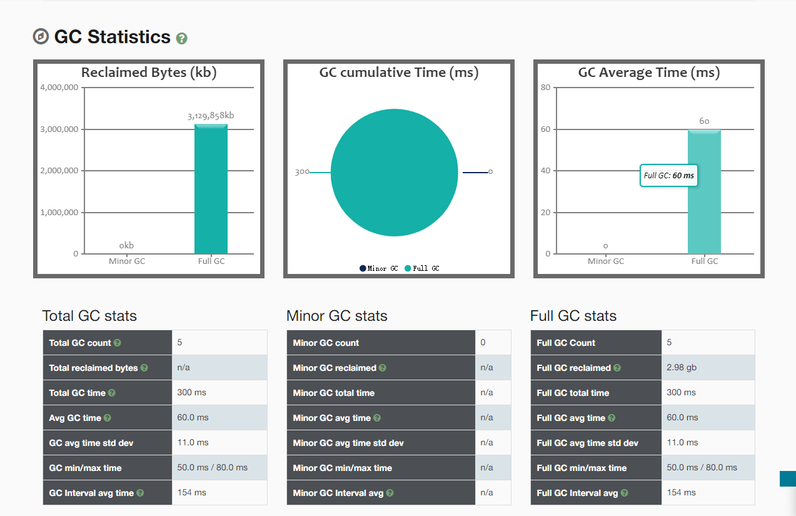

[toc]

---

# 题目

**1. （选做）**使用 GCLogAnalysis.java 自己演练一遍串行 / 并行 /CMS/G1 的案例。

**2. （选做）**使用压测工具（wrk 或 sb），演练 gateway-server-0.0.1-SNAPSHOT.jar 示例。

**3. （选做）**如果自己本地有可以运行的项目，可以按照 2 的方式进行演练。

**4. （必做）**根据上述自己对于 1 和 2 的演示，写一段对于不同 GC 和堆内存的总结，提交到 GitHub。

**5. （选做）**运行课上的例子，以及 Netty 的例子，分析相关现象。
**6. （必做）**写一段代码，使用 HttpClient 或 OkHttp 访问 [ http://localhost:8801 ](http://localhost:8801/)，代码提交到 GitHub


# 作业1

## 编码插曲

> javac GCLogAnalysis.java

出现错误: 编码GBK的不可映射字符，将文件重新保存为utf-8依然出错。于是在编译的时候，制定了编码格式

> javac -encoding utf8 GCLogAnalysis.java

编译成功，进入正题。


## 关于xms和xmn使用错误

> java -Xmx1g -Xmn1g -XX:+UseSerialGC -Xloggc:gc.serial.1g.log -XX:+PrintGCDetails -XX:+PrintGCDateStamps  GCLogAnalysis

文件地址： \project\src\main\java\top\zsmile\jvm\gc\gc.serial.xmn1g.log

```shell
Java HotSpot(TM) 64-Bit Server VM (25.201-b09) for windows-amd64 JRE (1.8.0_201-b09), built on Dec 15 2018 18:36:39 by "java_re" with MS VC++ 10.0 (VS2010)
Memory: 4k page, physical 8255784k(2719980k free), swap 13958276k(2202144k free)
CommandLine flags: -XX:InitialHeapSize=1073741824 -XX:MaxHeapSize=1073741824 -XX:MaxNewSize=1073741824 -XX:NewSize=1073741824 -XX:+PrintGC -XX:+PrintGCDetails -XX:+PrintGCTimeStamps -XX:+UseCompressedClassPointers -XX:+UseCompressedOops -XX:-UseLargePagesIndividualAllocation -XX:+UseSerialGC 
0.422: [GC (Allocation Failure) 0.422: [DefNew (promotion failed) : 838848K->943680K(943680K), 0.0392286 secs]0.462: [Tenured: 63K->63K(64K), 0.0369619 secs] 838848K->201251K(943744K), [Metaspace: 2628K->2628K(1056768K)], 0.0764888 secs] [Times: user=0.03 sys=0.05, real=0.08 secs] 
0.608: [Full GC (Allocation Failure) 0.608: [Tenured: 63K->63K(64K), 0.0489366 secs] 943383K->285338K(943744K), [Metaspace: 2628K->2628K(1056768K)], 0.0489981 secs] [Times: user=0.05 sys=0.00, real=0.05 secs] 
0.746: [Full GC (Allocation Failure) 0.746: [Tenured: 63K->63K(64K), 0.0544844 secs] 943721K->324420K(943744K), [Metaspace: 2628K->2628K(1056768K)], 0.0545447 secs] [Times: user=0.05 sys=0.00, real=0.05 secs] 
0.889: [Full GC (Allocation Failure) 0.889: [Tenured: 63K->63K(64K), 0.0546671 secs] 943733K->326006K(943744K), [Metaspace: 2628K->2628K(1056768K)], 0.0547235 secs] [Times: user=0.06 sys=0.00, real=0.06 secs] 
1.041: [Full GC (Allocation Failure) 1.041: [Tenured: 63K->63K(64K), 0.0605872 secs] 943632K->346444K(943744K), [Metaspace: 2628K->2628K(1056768K)], 0.0606417 secs] [Times: user=0.06 sys=0.00, real=0.06 secs] 
Heap
 def new generation   total 943680K, used 376722K [0x00000000c0000000, 0x00000000ffff0000, 0x00000000ffff0000)
  eden space 838848K,  44% used [0x00000000c0000000, 0x00000000d6fe4a60, 0x00000000f3330000)
  from space 104832K,   0% used [0x00000000f9990000, 0x00000000f9990000, 0x00000000ffff0000)
  to   space 104832K,   0% used [0x00000000f3330000, 0x00000000f3330000, 0x00000000f9990000)
 tenured generation   total 64K, used 63K [0x00000000ffff0000, 0x0000000100000000, 0x0000000100000000)
   the space 64K,  99% used [0x00000000ffff0000, 0x00000000ffffffe0, 0x0000000100000000, 0x0000000100000000)
 Metaspace       used 2634K, capacity 4486K, committed 4864K, reserved 1056768K
  class space    used 291K, capacity 386K, committed 512K, reserved 1048576K
```

这里因为错误的使用设置新生代大小的-Xmn1g，然后可以看见，-Xmn1g同时设置了-XX:MaxNewSize和-XX:NewSize即新生代的最大值和当前值为1G

```
CommandLine flags: -XX:InitialHeapSize=1073741824 -XX:MaxHeapSize=1073741824 **-XX:MaxNewSize=1073741824 -XX:NewSize=1073741824 -XX:+PrintGC** -XX:+PrintGCDateStamps -XX:+PrintGCDetails -XX:+PrintGCTimeStamps -XX:+UseCompressedClassPointers -XX:+UseCompressedOops -XX:-UseLargePagesIndividualAllocation -XX:+UseSerialGC 
```

先看作后面的堆信息

```
Heap
 def new generation   total 943680K, used 376722K [0x00000000c0000000, 0x00000000ffff0000, 0x00000000ffff0000)
  eden space 838848K,  44% used [0x00000000c0000000, 0x00000000d6fe4a60, 0x00000000f3330000)
  from space 104832K,   0% used [0x00000000f9990000, 0x00000000f9990000, 0x00000000ffff0000)
  to   space 104832K,   0% used [0x00000000f3330000, 0x00000000f3330000, 0x00000000f9990000)
 tenured generation   total 64K, used 63K [0x00000000ffff0000, 0x0000000100000000, 0x0000000100000000)
   the space 64K,  99% used [0x00000000ffff0000, 0x00000000ffffffe0, 0x0000000100000000, 0x0000000100000000)
 Metaspace       used 2634K, capacity 4486K, committed 4864K, reserved 1056768K
  class space    used 291K, capacity 386K, committed 512K, reserved 1048576K
```

可以看出：

- 年轻代的总大小是943M，使用了376M。
- 其中根据年轻代默认的eden和survive区分配比例8：2。eden区总大小838M，有44%使用了，s0和s1总大小一致，都为104M，无使用。
- 老年代的总大小64K，使用63K，这是很不合理的，分析后发现整个堆内存1G，然后因为配置错误，导致年轻代将整个堆内存占用了。
- Metaspace使用了2.6M，容量为4.4M。classspace使用了0.2M，容量为0.3M。


然后我们再看一下GC日志信息

```shell
0.422: [GC (Allocation Failure) 0.422: [DefNew (promotion failed) : 838848K->943680K(943680K), 0.0392286 secs]0.462: [Tenured: 63K->63K(64K), 0.0369619 secs] 838848K->201251K(943744K), [Metaspace: 2628K->2628K(1056768K)], 0.0764888 secs] [Times: user=0.03 sys=0.05, real=0.08 secs] 
0.608: [Full GC (Allocation Failure) 0.608: [Tenured: 63K->63K(64K), 0.0489366 secs] 943383K->285338K(943744K), [Metaspace: 2628K->2628K(1056768K)], 0.0489981 secs] [Times: user=0.05 sys=0.00, real=0.05 secs] 
0.746: [Full GC (Allocation Failure) 0.746: [Tenured: 63K->63K(64K), 0.0544844 secs] 943721K->324420K(943744K), [Metaspace: 2628K->2628K(1056768K)], 0.0545447 secs] [Times: user=0.05 sys=0.00, real=0.05 secs] 
0.889: [Full GC (Allocation Failure) 0.889: [Tenured: 63K->63K(64K), 0.0546671 secs] 943733K->326006K(943744K), [Metaspace: 2628K->2628K(1056768K)], 0.0547235 secs] [Times: user=0.06 sys=0.00, real=0.06 secs] 
1.041: [Full GC (Allocation Failure) 1.041: [Tenured: 63K->63K(64K), 0.0605872 secs] 943632K->346444K(943744K), [Metaspace: 2628K->2628K(1056768K)], 0.0606417 secs] [Times: user=0.06 sys=0.00, real=0.06 secs] 
```

从文件里可以看到第一次gc是在0.422秒，因为分配失败，这时年轻代还发生了一个异常错误promotion failed，年轻代总空间有943M，内存从838M增加到了943M，用时0.04s，然后老年代只有64k总大小，这使得年轻代的对象无法提升到老年代，只能继续积压在年轻代。

然后接着将对老年代对象回收，从63k到63k意味着没有回收，但是堆内存从838M降到了201M，可以推测一下应该是年轻代的对象直接被回收了。

从0.608开始法神了4次FullGC， 每次Full GC执行完后，老年代的占用空间都没有发生变化，对内存都出现来大幅度的下降，可以估计是年轻代的对象无法晋升老年代，直接被回收了。平均耗时0.5s左右。

总结：我们可以看出没有执行minorgc，全部都是majorGC，所有的回收都是fullGC回收的。把gc日志导入gceasy。可以看到这样的一份统计图验证猜想。




## 串行GC

> java -Xmx1g -Xms1g -XX:+UseSerialGC -Xloggc:gc.serial.1g.log -XX:+PrintGCDetails  GCLogAnalysis

文件地址： \project\src\main\java\top\zsmile\jvm\gc\gc.serial.1g.log

```shell
Java HotSpot(TM) 64-Bit Server VM (25.201-b09) for windows-amd64 JRE (1.8.0_201-b09), built on Dec 15 2018 18:36:39 by "java_re" with MS VC++ 10.0 (VS2010)
Memory: 4k page, physical 8255784k(2637420k free), swap 14880400k(2796136k free)
CommandLine flags: -XX:InitialHeapSize=1073741824 -XX:MaxHeapSize=1073741824 -XX:+PrintGC -XX:+PrintGCDetails -XX:+PrintGCTimeStamps -XX:+UseCompressedClassPointers -XX:+UseCompressedOops -XX:-UseLargePagesIndividualAllocation -XX:+UseSerialGC 
0.201: [GC (Allocation Failure) 0.201: [DefNew: 279616K->34944K(314560K), 0.0312410 secs] 279616K->83660K(1013632K), 0.0313687 secs] [Times: user=0.00 sys=0.03, real=0.03 secs] 
0.272: [GC (Allocation Failure) 0.272: [DefNew: 314560K->34944K(314560K), 0.0410823 secs] 363276K->161628K(1013632K), 0.0411405 secs] [Times: user=0.02 sys=0.03, real=0.04 secs] 
0.352: [GC (Allocation Failure) 0.352: [DefNew: 314560K->34943K(314560K), 0.0326501 secs] 441244K->234029K(1013632K), 0.0327081 secs] [Times: user=0.03 sys=0.00, real=0.03 secs] 
0.422: [GC (Allocation Failure) 0.422: [DefNew: 314559K->34943K(314560K), 0.0357819 secs] 513645K->316168K(1013632K), 0.0358370 secs] [Times: user=0.03 sys=0.00, real=0.04 secs] 
0.498: [GC (Allocation Failure) 0.498: [DefNew: 314559K->34943K(314560K), 0.0353872 secs] 595784K->392778K(1013632K), 0.0354687 secs] [Times: user=0.02 sys=0.02, real=0.04 secs] 
0.580: [GC (Allocation Failure) 0.580: [DefNew: 314559K->34944K(314560K), 0.0425928 secs] 672394K->477051K(1013632K), 0.0426480 secs] [Times: user=0.05 sys=0.00, real=0.04 secs] 
0.659: [GC (Allocation Failure) 0.659: [DefNew: 314560K->34943K(314560K), 0.0374878 secs] 756667K->558900K(1013632K), 0.0375414 secs] [Times: user=0.00 sys=0.03, real=0.04 secs] 
0.734: [GC (Allocation Failure) 0.734: [DefNew: 314559K->34943K(314560K), 0.0337327 secs] 838516K->635955K(1013632K), 0.0337867 secs] [Times: user=0.00 sys=0.03, real=0.03 secs] 
0.806: [GC (Allocation Failure) 0.806: [DefNew: 314559K->34943K(314560K), 0.0338643 secs] 915571K->710926K(1013632K), 0.0339186 secs] [Times: user=0.00 sys=0.03, real=0.03 secs] 
0.879: [GC (Allocation Failure) 0.879: [DefNew: 314559K->314559K(314560K), 0.0000119 secs]0.879: [Tenured: 675982K->373961K(699072K), 0.0619216 secs] 990542K->373961K(1013632K), [Metaspace: 2628K->2628K(1056768K)], 0.0624081 secs] [Times: user=0.06 sys=0.00, real=0.06 secs] 
0.983: [GC (Allocation Failure) 0.983: [DefNew: 279616K->34942K(314560K), 0.0154252 secs] 653577K->456559K(1013632K), 0.0154846 secs] [Times: user=0.02 sys=0.00, real=0.02 secs] 
1.044: [GC (Allocation Failure) 1.044: [DefNew: 314558K->34943K(314560K), 0.0239372 secs] 736175K->540799K(1013632K), 0.0240192 secs] [Times: user=0.02 sys=0.02, real=0.02 secs] 
Heap
 def new generation   total 314560K, used 195977K [0x00000000c0000000, 0x00000000d5550000, 0x00000000d5550000)
  eden space 279616K,  57% used [0x00000000c0000000, 0x00000000c9d42530, 0x00000000d1110000)
  from space 34944K,  99% used [0x00000000d3330000, 0x00000000d554fff8, 0x00000000d5550000)
  to   space 34944K,   0% used [0x00000000d1110000, 0x00000000d1110000, 0x00000000d3330000)
 tenured generation   total 699072K, used 505855K [0x00000000d5550000, 0x0000000100000000, 0x0000000100000000)
   the space 699072K,  72% used [0x00000000d5550000, 0x00000000f434ff20, 0x00000000f4350000, 0x0000000100000000)
 Metaspace       used 2634K, capacity 4486K, committed 4864K, reserved 1056768K
  class space    used 291K, capacity 386K, committed 512K, reserved 1048576K

```

