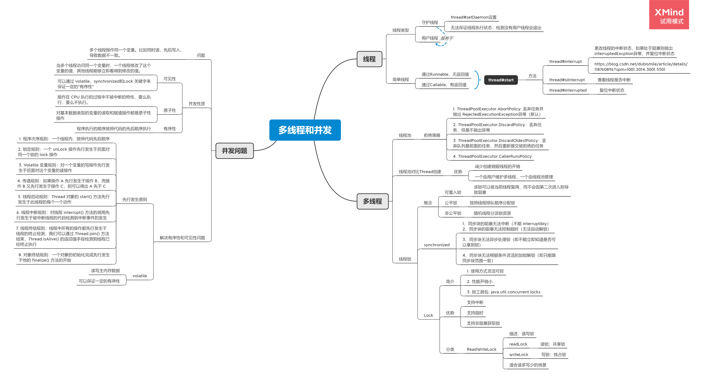

[toc]


---


# 题目

**1.（选做）**把示例代码，运行一遍，思考课上相关的问题。也可以做一些比较。

**2.（必做）**思考有多少种方式，在 main 函数启动一个新线程，运行一个方法，拿到这
个方法的返回值后，退出主线程? 写出你的方法，越多越好，提交到 GitHub。
一个简单的代码参考: [ https://github.com/kimmking/JavaCourseCodes/tree/main/03concurrency/0301 ](https://github.com/kimmking/JavaCourseCodes/tree/main/03concurrency/0301)/src/main/java/java0/conc0303/Homework03.java

**3.（选做）**列举常用的并发操作 API 和工具类，简单分析其使用场景和优缺点。
**4.（选做）**请思考: 什么是并发? 什么是高并发? 实现高并发高可用系统需要考虑哪些 因素，对于这些你是怎么理解的?
**5.（选做）**请思考: 还有哪些跟并发类似 / 有关的场景和问题，有哪些可以借鉴的解决 办法。
**6.（必做）**把多线程和并发相关知识梳理一遍，画一个脑图，截图上传到 GitHub 上。 可选工具:xmind，百度脑图，wps，MindManage，或其他。


# 作业2

代码路径：project\src\main\java\top\zsmile\conc\conc.java

```java
public class HomeWork02 {
    public static void main(String[] args) throws ExecutionException, InterruptedException {
        FutureTaskCall futureTaskCall = new FutureTaskCall();
        FutureTask<String> futureTask = new FutureTask<>(futureTaskCall);
        new Thread(futureTask).start();
        System.out.println("FutureTaskCall返回值：" + futureTask.get());

        ExecutorService executorService = Executors.newSingleThreadExecutor();
        Future<?> executorFuture = executorService.submit(futureTaskCall);
        System.out.println("executorFuture返回值：" + executorFuture.get());

        CompletableFuture<Integer> cf = CompletableFuture.supplyAsync(HomeWork02::sum);
        System.out.println("completableFuture返回值：" + cf.get());

        AtomicInteger atomicInteger = new AtomicInteger();
        Thread thread = new Thread(() -> {
            atomicInteger.set(sum());
        });
        thread.start();
        thread.join();
        System.out.println("atomicInteger返回值：" + atomicInteger.get());

        Thread thread1 = new Thread(() -> {
            intValue = sum();
        });
        thread1.start();
        while (intValue == null) {
        }
        System.out.println("intValue返回值：" + atomicInteger.get());

        SynThread synThread = new SynThread();
        Thread thread2 = new Thread(() -> {
            synThread.sum();
        });
        thread2.start();
        System.out.println("SynThread返回值：" + synThread.getValue());

        CountDownLatch countDownLatch = new CountDownLatch(1);
        CountDownlatchTask countDownlatchTask = new CountDownlatchTask(countDownLatch);
        Thread thread3 = new Thread(() -> {
            countDownlatchTask.sum();
        });
        thread3.start();
        System.out.println("countDownlatchTask返回值：" + countDownlatchTask.getValue());

        SemaphoreTask semaphoreTask = new SemaphoreTask();
        Thread thread4 = new Thread(() -> {
            try {
                semaphoreTask.sum();
            } catch (InterruptedException e) {
                e.printStackTrace();
            }
        });
        thread4.start();
        System.out.println("semaphoreTask返回值：" + semaphoreTask.getValue());

        CyclicBarrierTask cyclicBarrierTask = new CyclicBarrierTask();
        CyclicBarrier cyclicBarrier = new CyclicBarrier(1, () -> {
            System.out.println("cyclicBarrierTask返回值：" + cyclicBarrierTask.getValue());
        });
        new Thread(() -> {
            try {
                cyclicBarrierTask.sum();
                cyclicBarrier.await();
            } catch (InterruptedException e) {
                e.printStackTrace();
            } catch (BrokenBarrierException e) {
                e.printStackTrace();
            }
        }).start();

    }

    static class CyclicBarrierTask {

        private volatile Integer value = null;

        public void sum() {
            value = fibo(36);
        }

        private static int fibo(int a) {
            if (a < 2)
                return 1;
            return fibo(a - 1) + fibo(a - 2);
        }

        public Integer getValue() {
            return this.value;
        }
    }

    static class SemaphoreTask {

        private volatile Integer value = null;
        private Semaphore semaphore = new Semaphore(1);

        public void sum() throws InterruptedException {
            semaphore.acquire();
            value = fibo(36);
            semaphore.release();
        }

        private static int fibo(int a) {
            if (a < 2)
                return 1;
            return fibo(a - 1) + fibo(a - 2);
        }

        public Integer getValue() throws InterruptedException {
            Integer c = null;
            while (this.value == null) {
            }
            semaphore.acquire();
            c = this.value;
            semaphore.release();
            return c;

        }
    }


    static class CountDownlatchTask {

        private volatile Integer value = null;
        private CountDownLatch latch = null;

        public CountDownlatchTask(CountDownLatch countDownLatch) {
            this.latch = countDownLatch;
        }

        public void sum() {
            value = fibo(36);
            latch.countDown();
        }

        private static int fibo(int a) {
            if (a < 2)
                return 1;
            return fibo(a - 1) + fibo(a - 2);
        }

        public Integer getValue() throws InterruptedException {
            latch.await();
            return value;
        }
    }

    static class SynThread {

        private volatile Integer value = null;

        synchronized public void sum() {
            value = fibo(36);
            notify();
        }

        private static int fibo(int a) {
            if (a < 2)
                return 1;
            return fibo(a - 1) + fibo(a - 2);
        }

        synchronized public Integer getValue() throws InterruptedException {
            while (value == null) {
                wait();
            }
            return value;
        }
    }


    public volatile static Integer intValue = null;

    static class FutureTaskCall implements Callable<String> {
        @Override
        public String call() throws Exception {
            int num = sum();
            return num + "";
        }
    }


    private static int sum() {
        Random random = new Random();
        return fibo(random.nextInt(20) + 1);
    }

    private static int fibo(int a) {
        if (a < 2)
            return 1;
        return fibo(a - 1) + fibo(a - 2);
    }

}
```


# 作业6

因为外出出差，暂时没写完

