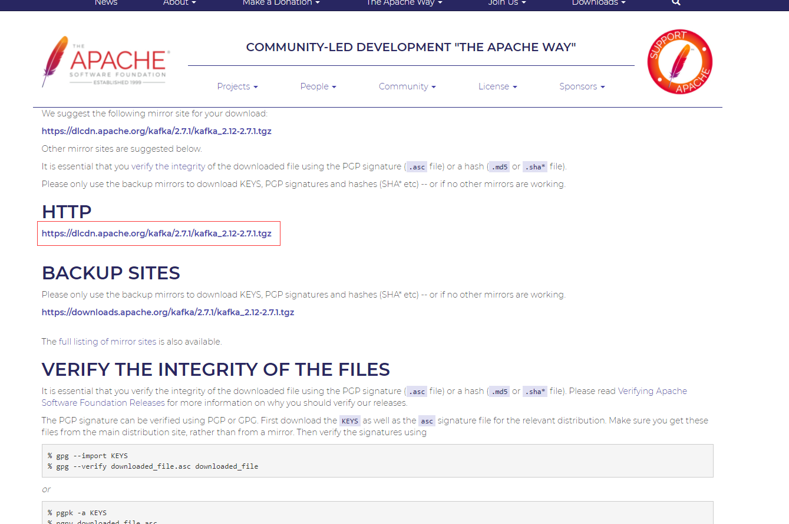

[toc]

---

# 题目

**1.（必做）**搭建一个 3 节点 Kafka 集群，测试功能和性能；实现 spring kafka 下对 kafka 集群的操作，将代码提交到 github。

**2.（选做）**安装 kafka-manager 工具，监控 kafka 集群状态。

**3.（挑战☆）**演练本课提及的各种生产者和消费者特性。

**4.（挑战☆☆☆）**Kafka 金融领域实战：在证券或者外汇、数字货币类金融核心交易系统里，对于订单的处理，大概可以分为收单、定序、撮合、清算等步骤。其中我们一般可以用 mq 来实现订单定序，然后将订单发送给撮合模块。

- 收单：请实现一个订单的 rest 接口，能够接收一个订单 Order 对象；
- 定序：将 Order 对象写入到 kafka 集群的 order.usd2cny 队列，要求数据有序并且不丢失；
- 撮合：模拟撮合程序（不需要实现撮合逻辑），从 kafka 获取 order 数据，并打印订单信息，要求可重放, 顺序消费, 消息仅处理一次。

**5.（选做）**自己安装和操作 RabbitMQ，RocketMQ，Pulsar，以及 Camel 和 Spring Integration。

**6.（必做）**思考和设计自定义 MQ 第二个版本或第三个版本，写代码实现其中至少一个功能点，把设计思路和实现代码，提交到 GitHub。

**7.（挑战☆☆☆☆☆）**完成所有其他版本的要求。期限一年。


# 作业1

## 下载kafka 2.71

下载连接：https://www.apache.org/dyn/closer.cgi?path=/kafka/2.7.1/kafka_2.12-2.7.1.tgz




## 配置集群

配置文件地址：[server9011.properties](https://github.com/smileluck/geek-study/blob/main/job/week13/server9011.properties)，[server9012.properties](https://github.com/smileluck/geek-study/blob/main/job/week13/server9012.properties)，[server9013.properties](https://github.com/smileluck/geek-study/blob/main/job/week13/server9013.properties)

1. 在server.properties的基础上，复制3份文件，重命名为server9011.properties，server9012.properties，server9013.properties。
2. 修改文件内容。

```properties
# server9011.properties
listeners=PLAINTEXT://:9011
log.dirs=D:/software/kafka_2.13-2.7.1/kafka-logs1
# server9012.properties
listeners=PLAINTEXT://:9012
log.dirs=D:/software/kafka_2.13-2.7.1/kafka-logs2
# server9013.properties
listeners=PLAINTEXT://:9012
log.dirs=D:/software/kafka_2.13-2.7.1/kafka-logs3
```

3. 启动服务

```shell
 # 要先启动zookeeper服务
 .\bin\windows\zookeeper-server-start.bat  .\config\zookeeper.properties
 
 # 依次启动kafks服务
 .\bin\windows\kafka-server-start.bat .\config\server9011.properties
 .\bin\windows\kafka-server-start.bat .\config\server9012.properties
 .\bin\windows\kafka-server-start.bat .\config\server9013.properties

```


### 异常记录

启动kafka时，会出现异常：这时因为zookeeper里面的信息有冲突。我们将zookeeper数据清空，并将kafka-logs*的文件夹下的文件删除，重新启动即可。

```java
ERROR Fatal error during KafkaServer startup. Prepare to shutdown (kafka.server.KafkaServer)
kafka.common.InconsistentClusterIdException: The Cluster ID Rv30bYQFSMWb6wFHgx3EMw doesn't match stored clusterId Some(KGRNd5JtSxSIb-U-P8VZ5A) in meta.properties. The broker is trying to join the wrong cluster. Configured zookeeper.connect may be wrong.
        at kafka.server.KafkaServer.startup(KafkaServer.scala:252)
        at kafka.server.KafkaServerStartable.startup(KafkaServerStartable.scala:44)
        at kafka.Kafka$.main(Kafka.scala:82)
        at kafka.Kafka.main(Kafka.scala)
```


## Spring kafka

测试代码：[主函数](https://github.com/smileluck/geek-study/blob/main/mq-project/src/main/java/top/zsmile/kafka/demo/KafkaApplication.java)，[Consumer](https://github.com/smileluck/geek-study/blob/main/mq-project/src/main/java/top/zsmile/kafka/demo/KafkaConsumer.java)，[Producer](https://github.com/smileluck/geek-study/blob/main/mq-project/src/main/java/top/zsmile/kafka/demo/KafkaProducer.java)

### 引入POM

```xml
<dependency>
    <groupId>org.springframework.kafka</groupId>
    <artifactId>spring-kafka</artifactId>
</dependency>
<dependency>
    <groupId>org.projectlombok</groupId>
    <artifactId>lombok</artifactId>
	<optional>true</optional>
</dependency>
<dependency>
	<groupId>org.springframework.boot</groupId>
	<artifactId>spring-boot-starter</artifactId>
</dependency>
```

### 配置yml

```yaml
server:
  port: 9999
spring:
  kafka:
    bootstrap-servers: 127.0.0.1:9011,127.0.0.1:9012,127.0.0.1:9013 # 设置为自己的kafka集群
    consumer:
      group-id: test-consumer-group
      auto-offset-reset: earliest
      enable-auto-commit: true
      auto-commit-interval: 100
      key-deserializer: org.apache.kafka.common.serialization.StringDeserializer
      value-deserializer: org.apache.kafka.common.serialization.StringDeserializer
    producer:
      retries: 0
      batch-size: 16384
      buffer-memory: 33554432
      key-serializer: org.apache.kafka.common.serialization.StringSerializer
      value-serializer: org.apache.kafka.common.serialization.StringSerializer
```

### ConsumerTest

```java
@Component
public class KafkaConsumer {
    @KafkaListener(topics = {"topic-test"})
    public void listen(ConsumerRecord<?, ?> record) {
        Optional<?> kafkaMessage = Optional.ofNullable(record.value());
        if (kafkaMessage.isPresent()) {
            Object message = kafkaMessage.get();
            System.out.println(record + "=>" + message);
        }
    }
}
```

### ProducerTest

```java
@RunWith(SpringRunner.class)

@SpringBootTest()
public class ProducerTest {
    @Autowired
    private KafkaProducer kafkaProducer;

    @Test
    public void produce() {
        kafkaProducer.send();
    }
}
```


# 作业6

## 版本二

代码目录：[地址](https://github.com/smileluck/geek-study/tree/main/smile-mq/sec-edition-mq/src/main/java/top/zsmile/mq)

测试代码：[文件地址](https://github.com/smileluck/geek-study/tree/main/smile-mq/sec-edition-mq/src/main/java/top/zsmile/mq)

```java
public class SmqDemo {
    @SneakyThrows
    public static void main(String[] args) {
        SmqBroker smqBroker = new SmqBroker();
        SmqConsumer consumer = smqBroker.createConsumer();

        consumer.substribe("test1");
        consumer.substribe("test2");
        new Thread(new SmqConsumerRunner(consumer)).start();

        SmqProducer smqProducer = smqBroker.createProducer();
        for (int i = 1; i <= 10; i++) {
            smqProducer.send("test1", new SmqMessage(null, "int i=>" + i));
        }
        Thread.sleep(500);
        System.out.println("点击任何键，发送一条消息；点击q或e，退出程序。");
        boolean s = true;
        while (true) {
            char c = (char) System.in.read();
            if (c == 'a') {
                smqProducer.send("test2", new SmqMessage(null, "time=>" + System.currentTimeMillis()));
                continue;
            }
            if (c == 'b' && s) {
                SmqConsumer consumer2 = smqBroker.createConsumer();
                consumer2.substribe("test1");
                new Thread(new SmqConsumerRunner(consumer2)).start();
            }

            if (c > 20) {
                System.out.println(c);
                smqProducer.send("test1", new SmqMessage(null, "char c=>" + c));
            }


            if (c == 'q' || c == 'e') break;
        }
    }

}
```


### Queue方面

使用了ArrayList替代了，然后使用wIndex记录了当前写的地址。读的时候，通过比较传入的读下标和队列的写下标是否相等，读下标小于写下标，则获取数据

```java

public class SmqQueue {
    private List<SmqMessage> messages;
    private int wIndex;

    public SmqQueue() {
        messages = new ArrayList<>();
        wIndex = 0;
    }

    public boolean write(SmqMessage smqMessage) {
        boolean add = messages.add(smqMessage);
        if (add) {
            wIndex++;
        }
        return add;
    }

    public SmqMessage read(int readIndex) {
        if (readIndex == wIndex) {
            return null;
        }
        SmqMessage smqMessage = messages.get(readIndex);
        return smqMessage;
    }

}
```


 ### 数据消费

这一版本将数据消费的读指针放在了consumer端，每一个consumer对一个topic持有一个读下标。

这样每个consumer都会重复消费一次数据。

```java

public class SmqChannelVO {
    private int readIndex;
    private SmqChannel channel;

    public SmqChannelVO(SmqChannel smqChannel) {
        this.readIndex = 0;
        this.channel = smqChannel;
    }

    public SmqMessage poll() {
        SmqMessage message = this.channel.poll(readIndex);
        if (message != null) {
            this.readIndex++;
        }
        return message;
    }

    public String getTopic() {
        return channel.getTopic();
    }
}
```


然后使用List存储consumer端订阅的topic，然后启动consumer时启动一个线程对topic轮询获取数据

```java
public class SmqConsumerRunner implements Runnable {
    private SmqConsumer consumer;

    public SmqConsumerRunner(SmqConsumer consumer) {
        this.consumer = consumer;
    }

    @Override
    public void run() {
        while (true) {
            List<SmqChannelVO> channels = consumer.getChannels();
            for (SmqChannelVO channelVO : channels) {
                SmqMessage message = consumer.getMessage(channelVO);
                if (null != message) {
                    System.out.println(consumer.getId() + "_" + channelVO.getTopic() + " receive:" + message.getBody());
                }
            }
            try {
                Thread.sleep(100);
            } catch (InterruptedException e) {
                e.printStackTrace();
            }
        }
    }
}

```


## 版本三

代码目录：[地址](https://github.com/smileluck/geek-study/tree/main/smile-mq/third-edition-mq/src/main/java/top/zsmile/mq/broker)

测试代码：[MQ服务](https://github.com/smileluck/geek-study/blob/main/smile-mq/third-edition-mq/src/main/java/top/zsmile/mq/broker/BrokerApplication.java)，[ProducerTest](https://github.com/smileluck/geek-study/blob/main/smile-mq/third-edition-mq/src/test/java/top/zsmile/mq/ProducerTest.java)，[ConsumerTest](https://github.com/smileluck/geek-study/blob/main/smile-mq/third-edition-mq/src/test/java/top/zsmile/mq/ConsumerTest.java)

分离服务端，并将读下标放到MQ服务端统一读，每次读后，会消费数据，但是没有将数据弹出。还是会存储在内存中。

